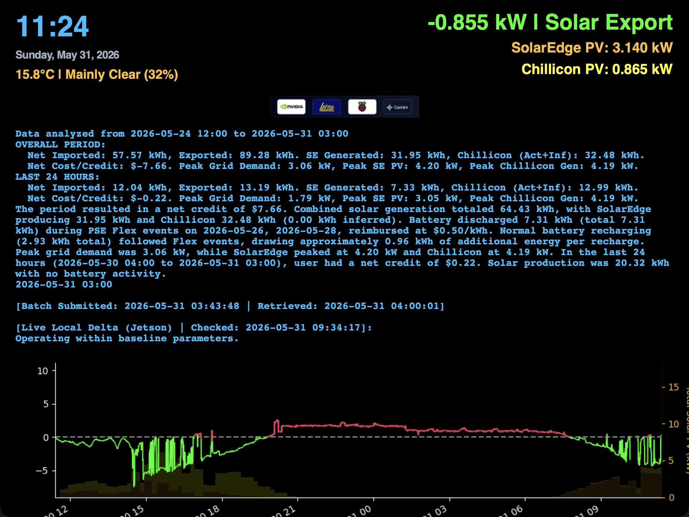
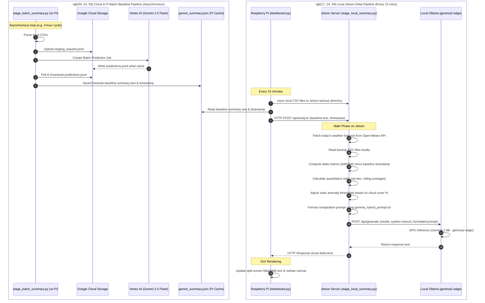

# EMU-2 Grid Dashboard



A robust, 24-hour real-time grid monitoring dashboard using a Rainforest EMU-2 smart meter connected to a Raspberry Pi. It automatically boots into a fullscreen kiosk mode over HDMI, safely bypasses modern Wayland graphic quirks, and seamlessly persists data to a CSV to survive power outages.

> [!NOTE]
> **Product & Compatibility Note:** The Rainforest EMU-2 is a legacy hardware product that has been discontinued. For deployments using current-generation hardware, the **Rainforest EAGLE 3** features a local API that outputs a very similar XML structure, making this dashboard framework highly compatible and adaptable for it.

## Hardware Requirements
- **Raspberry Pi** (Pi 3 or 4 recommended)
- **Rainforest EMU-2** connected via USB (`/dev/ttyACM0`)
- **HDMI Monitor** (The script dynamically scales to fullscreen, mimicking commercial 10" or larger solar dashboards)

## Connecting to Your Smart Meter (PSE & Others)
Because the monitor reads data directly from the Zigbee wireless network inside your utility's smart meter, it must be paired and provisioned with the meter:
1. **Purchase the Device**: Rainforest monitors can be purchased directly from the [Rainforest US Retail Store](https://rainforest-store-us.myshopify.com/).
2. **Contact Puget Sound Energy (PSE)**: Call PSE Customer Care at **1-888-225-5773** and ask them to pair/provision a **"Home Area Network (HAN) device."** You will need to provide them with the device's **MAC Address** and **Install Code** printed on the label on the back of the monitor.
3. **Other Utilities**: If your utility provider is not PSE, contact your utility's customer service or search their website for "HAN provisioning" or "Smart Meter pairing" to follow their specific activation process.

## Key Features
- **Real-Time Data Parsing**: Decodes raw XML telemetry (`<InstantaneousDemand>`) directly from the EMU-2 serial port.
- **Rolling 24-Hour Graph**: Features a dynamic rolling 24-hour X-axis with the newest readings always positioned on the far right, ensuring the graph is always fully populated with historical context.
- **Persistent Data**: Logs data automatically to `grid_history.csv` every 15 seconds, SolarEdge PV to `solaredge_history.csv` every 15 minutes, battery metrics to `solaredge_battery_history.csv` every 15 minutes, and Chillicon production to `chilicon_history.csv` every 15 minutes, retroactively reloading the graph and historical context immediately upon boot.
- **SolarEdge PV & Battery Integration**: Polls SolarEdge `/currentPowerFlow` to track real-time solar panel output, signed battery charge/discharge rates, and State of Charge (SoC %).
- **Chillicon Cloud API Integration**: Polls actual microinverter solar generation (production power in kW and cumulative lifetime generation in Wh) from Chillicon Cloud every 15 minutes using persistent session cookie authentication.
- **Stacked Solar PV Chart**: Stacks the actual Chillicon generation (plotted as a bright neon yellow cap) on top of the SolarEdge PV bars (warm gold base) on a unified 10-minute grid, displaying your total combined solar output on the secondary Y-axis.
- **Hands-Free Kiosk Mode**: Configured to boot completely headless and automatically launch into fullscreen without sleeping.
- **Gemini Background Summaries**: Uses a background thread to call the Gemini 2.5 Flash model (via Vertex AI or Developer API Key) to analyze power trends and render a blue narrative watermark summary directly on the graph background, formatted with smart 80-character line wrapping.

---

## AI Background Summaries & Authentication

The dashboard integrates the **`google-genai`** SDK to query Gemini every 15 minutes in a non-blocking background thread. The generated summary is cached locally to disk at `gemini_summary.json` inside the repository directory and loads instantly on startup. 

The prompt includes hourly aggregated Net Grid import/export statistics, SolarEdge solar generation, battery stats (`Battery_Avg_kW` average discharge rate and `Battery_SoC` average charge percentage), and actual Chillicon generation (`Chillicon_Avg_kW`). This enables Gemini to make highly accurate summaries and correctly separate battery dispatch behavior during Puget Sound Energy (PSE) Flex events (reimbursed at a premium rate of **$0.50 / kWh** instead of the standard $0.19 / kWh) from your actual solar arrays' generation without needing mathematical inference.

### Authentication Setup
The dashboard automatically searches for credentials using one of the following methods:
1. **Google Cloud Service Account JSON (Headless/Vertex AI):**
   - Place the service account JSON key at `~/Auth/service_account.json` (or `auth/service_account.json` in the application directory).
   - The script routes queries via Vertex AI using the project `<your-gcp-project-id>` and location `global`.
   - Detailed instructions on setting up your Vertex AI Google Cloud account and generating service account keys can be found in the [veo-video-creation-workflow README](https://github.com/<your-github-username>/veo-video-creation-workflow/blob/main/README.md).
2. **Developer API Key:**
   - Create a `.env` file in the same directory as `dashboard.py` and define:
     ```env
     GEMINI_API_KEY="your_api_key_here"
     ```

### SolarEdge API Configuration
To enable SolarEdge PV and battery storage telemetry overlay and mathematical analysis in the Gemini prompt, configure your SolarEdge API credentials inside `~/Auth/solaredge_config.json` (or `auth/solaredge_config.json` in the application directory):
```json
{
  "api_key": "your_solaredge_api_key",
  "site_id": "your_solaredge_site_id"
}
```
*Note: If you do not have your SolarEdge API key or Site ID, you will need to contact your solar system installer to request API access for your monitoring account.*

### Chillicon Cloud API Configuration
To enable the Chillicon Cloud API integration, configure your login credentials inside `~/Auth/chilicon_config.json` (or `auth/chilicon_config.json` in the application directory):
```json
{
  "username": "your_chilicon_email",
  "password": "your_chilicon_password",
  "installation_hash": "abcdef1234567890abcdef1234567890abcdef1234567890abcdef1234567890"
}
```
*Note: To find your `installation_hash`, log in to your account at `https://cloud.chiliconpower.com`, click on your solar installation dashboard, and inspect the URL in your browser's address bar. The long hexadecimal string at the end of the URL is your installation hash:*
`https://cloud.chiliconpower.com/installation/abcdef1234567890abcdef1234567890abcdef1234567890abcdef1234567890`

---

## Decoupled Architecture (Pi & Cloud Batch)

For production systems, this repository supports a **decoupled architecture**. This separates the resource-heavy LLM inference from the real-time Tkinter GUI process.

You can configure this using the `LLM_MODE` setting in your `.env` file:
* **`LLM_MODE=direct` (Default)**: The GUI runs an inline background thread that queries the Gemini API directly every 15 minutes. Best for simple, out-of-the-box local developer testing.
* **`LLM_MODE=decoupled`**: The GUI runs as a pure cache consumer, disabling internal API calls and polling `gemini_summary.json` every 10 seconds for updates. This lets an external background process update the cache.

### Cloud Batch Staging (Raspberry Pi)
When running `LLM_MODE=decoupled` on the Raspberry Pi:
* Run the background script `stage_batch_summary.py` in a separate screen or service session.
* This script compiles the telemetry data, uploads it to GCS, schedules a **Vertex AI Batch Prediction** job, and polls the job state.
* **Significant Cost Savings**: Vertex AI Batch predictions offer a **50% discount** per token compared to direct synchronous API calls. Additionally, polling the job status is a metadata query which is **100% free** under Google Cloud, allowing the stager to check frequently without incurring any API polling costs.
* It persists the active job state to `active_batch_job.json` to safely resume polling even across unexpected reboots (watchdog recovery).

Detailed instructions on how to set up the necessary Google Cloud Storage buckets, service accounts, and permissions for the Vertex AI Batch prediction environment can be found in the [Gemini Photo Batch Workflow repository](https://github.com/smichalove/Gemini_Photo_Batch_Workflow).

---

## Local Edge AI (Jetson / Nvidia Hardware) Setup

To perform inference completely offline on local Nvidia hardware (such as an Nvidia Jetson Orin Nano) without cloud API costs or dependencies, the dashboard supports a **Jetson-Centric Edge Server Architecture**. 

### Architectural Overview & Reasoning

Instead of running mathematical integrations and LLM queries directly on the Raspberry Pi (which has constrained CPU/memory and is prone to SD card failure under continuous disk writes), the dashboard offloads the heavy lifting to the Jetson Orin:

1. **Computational Offloading:** The Jetson Orin performs all quantitative telemetry math (integrals, peaks, rolling averages, standard deviations, and Pearson correlation coefficients) and runs local LLM inference via Ollama.
2. **Automated Backup & SD Card Longevity:** On each analysis cycle, the Pi dashboard transfers its telemetry CSVs directly to the Jetson's NVMe SSD using `rsync`. This provides automatic remote backups and protects the Pi's SD card from continuous disk scans.
3. **Weather-Weighted Modeling:** The Jetson edge server fetches local daily forecasts (temperature and cloud cover percentage) from the free Open-Meteo API. It dynamically scales the expected solar baseline to prevent false "solar deficit" anomaly warnings on overcast days.



### 1. Ollama Installation & Model Setup
On your Nvidia Jetson Orin:

#### Step A: Install Ollama
Install the official Ollama service (which supports ARM64/JetPack out of the box):
```bash
curl -fsSL https://ollama.com/install.sh | sh
```

#### Step B: Allocate Swap Space on the SSD
The upgraded 9B model (`gemma2:9b` or `gemma2-edge`) can exhaust the shared unified memory of a Jetson Orin (such as an Orin Nano 4GB or 8GB), causing the inference runner process to crash (e.g., returning EOF or exit code -1). To prevent this, configure a 4GB swap space on the SSD:
```bash
# 1. Allocate a 4GB file
sudo fallocate -l 4G /swapfile

# 2. Secure file permissions
sudo chmod 600 /swapfile

# 3. Format as swap space
sudo mkswap /swapfile

# 4. Activate it instantly
sudo swapon /swapfile

# 5. Persist across system reboots
echo '/swapfile swap swap defaults 0 0' | sudo tee -a /etc/fstab
```

#### Step C: Build the Optimized Custom Model (`gemma2-edge`)
To avoid memory exhaustion or connection timeouts on unified memory hardware, run a custom model using a `Modelfile` to restrict the context window (`num_ctx 1024`) and limit prediction length (`num_predict 512`):
```bash
# 1. Pull the 3-bit weight map of Gemma 2 9B
ollama pull gemma2:9b-instruct-q3_K_M

# 2. Create the Modelfile with optimized limits
cat << 'EOF' > Modelfile
FROM gemma2:9b-instruct-q3_K_M
PARAMETER num_ctx 1024
PARAMETER num_predict 512
EOF

# 3. Register the custom edge-optimized model
ollama create gemma2-edge -f Modelfile
```

#### Step D: Jetson-Stats (`jtop`) Installation
Install `jetson-stats` to monitor system resources, memory consumption, and GPU utilization:
```bash
# 1. Install pip
sudo apt update
sudo apt install -y python3-pip

# 2. Install jetson-stats via pip
sudo pip3 install jetson-stats

# 3. Restart the telemetry service
sudo systemctl restart jtop.service
```
*(Note: You may need to reboot the board or re-login for the command group changes to take effect.)*

#### Step E: Grant Hardware-Acceleration Access
To ensure background daemon services (like `grid_backup` running the stager script) can access the GPU hooks via JetPack without permission errors, add the daemon user and your primary user to the `video` group:
```bash
# 1. Add current user and backup daemon user to the video group
sudo usermod -aG video $USER
sudo usermod -aG video grid_backup

# 2. Restart Ollama to pick up the new group permissions
sudo systemctl restart ollama
```

### 2. Configure SSH Public Key & Security Hardening
Since the Raspberry Pi is a physical kiosk, its local SSH private key is vulnerable to extraction if the device is compromised. To enforce the **Principle of Least Privilege**, we create a dedicated, low-privilege account on the Jetson and restrict the SSH key strictly to `rsync` sync operations.

#### Step A: Create a Restricted User on the Jetson
On the Jetson, create a user `grid_backup` with no `sudo` privileges and shell login disabled:
```bash
# Create the user with nologin shell to prevent shell access
sudo useradd -m -s /usr/sbin/nologin grid_backup

# Create the target backup directory and change ownership
sudo mkdir -p /home/grid_backup/backups
sudo chown -R grid_backup:grid_backup /home/grid_backup/backups
```

#### Step B: Set Up the SSH Public Key
1. **Generate SSH key on the Pi** (if not already present):
   ```bash
   ssh-keygen -t rsa -b 4096 -N "" -f ~/.ssh/id_rsa
   ```
2. **Copy the Pi's public key to the Jetson's new account**:
   ```bash
   ssh-copy-id -i ~/.ssh/id_rsa.pub grid_backup@<jetson-ip>
   ```

#### Step C: Restrict SSH Key Command Execution
On the Jetson, edit `/home/grid_backup/.ssh/authorized_keys` and prepend options to the Pi's public key (the line beginning with `ssh-rsa ...`) to enforce command restriction. This forces the key to only be usable for `rsync` file syncing to the backups folder using the restricted `rrsync` utility:
```text
restrict,command="/usr/bin/rrsync /home/grid_backup/backups/" ssh-rsa AAAAB3NzaC1yc2EAAAADAQABAAACAQD...
```
* `restrict`: Blocks port forwarding, agent forwarding, X11 forwarding, and shell allocation.
* `command="..."`: Restricts the incoming SSH connection to ONLY execute rsync commands within the `/home/grid_backup/backups/` directory, preventing interactive terminal access or file reads/writes outside the target directory.

> [!WARNING]
> **Strict SSH Directory Permissions Required:** SSH will reject public key authentication if directory permissions are too open. If `rsync` still prompts for a password after copying the key, run these commands on the **Jetson** to secure the `grid_backup` SSH configuration folder:
> ```bash
> chmod 700 /home/grid_backup/.ssh
> chmod 600 /home/grid_backup/.ssh/authorized_keys
> ```
> If these are group-writeable, the SSH daemon falls back to interactive password prompts, causing the Pi's background daemon sync thread to fail.

### 3. Launching the Jetson Edge Server
Run the lightweight analysis handler `stage_local_summary.py` on the Jetson:
```bash
python3 stage_local_summary.py --port=5000
```
This launches a zero-dependency HTTP server that listens on port 5000 for incoming sync metrics triggers.

### 4. Configure Dashboard Environment (Pi)
Configure the connection properties in the `.env` file on the Pi:
```env
LLM_MODE="decoupled"
JETSON_HOST="<your-jetson-ip>"
JETSON_USER="<your-jetson-username>"
JETSON_BACKUP_PATH="/home/<your-jetson-username>/rainforest-emu2-grid-dashboard/backups/"
JETSON_PORT=5000
```

### 5. Running the Decoupled System
1. **Start the GUI on the Pi**:
   ```bash
   python3 dashboard.py
   ```
   In `decoupled` mode, it will poll the baseline summaries locally, run the background `rsync` syncs, and hit the Jetson HTTP server every 15 minutes for local delta updates.
2. **Start the Cloud Batch Stager (Optional)**:
   If you want to feed high-fidelity Cloud Vertex AI baselines to the local system, run `stage_batch_summary.py` on the Pi:
   ```bash
   python3 stage_batch_summary.py
   ```

---

## Complete Setup Instructions

### 0. Clone the Repository
Clone this repository directly to your user's home directory on the Raspberry Pi:
```bash
cd ~
git clone https://github.com/<your-github-username>/rainforest-emu2-grid-dashboard.git
cd rainforest-emu2-grid-dashboard
```

### 1. Revert to X11 (Debian Bookworm)
Modern Raspberry Pi OS uses Wayland, which severely limits X11 forwarding and headless Tkinter display configurations over SSH. Revert to the highly stable X11 (LightDM) backend:
```bash
sudo raspi-config
# Navigate to: Advanced Options -> Wayland -> Choose X11
sudo reboot
```

### 2. Disable Screen Blanking
To prevent the HDMI screen from going to sleep after 10 minutes of inactivity, create an autostart script that disables power-management on boot:
```bash
mkdir -p ~/.config/autostart
nano ~/.config/autostart/disable-blanking.desktop
```
Add the following configuration:
```ini
[Desktop Entry]
Type=Application
Name=Disable Blanking
Exec=/usr/bin/xset s off -dpms
StartupNotify=false
Terminal=false
```

### 3. Autostart the Dashboard
Create a second desktop entry to automatically launch the python dashboard when the desktop environment finishes loading:
```bash
nano ~/.config/autostart/grid-dashboard.desktop
```
Add the following configuration (be sure to replace `username` with your Pi's actual user account name, e.g. `steven` or `pi`):
```ini
[Desktop Entry]
Type=Application
Name=Grid Dashboard
Exec=/home/username/rainforest-emu2-grid-dashboard/run_dashboard_system.sh
StartupNotify=false
Terminal=false
```

### 4. Install Dependencies & X11 Autostart
Modern Debian distributions (like Bookworm on Raspberry Pi) enforce PEP 668, preventing direct `pip` installations. 
1. Clone the repository to your Raspberry Pi.
2. Run the deployment script to create the Python virtual environment, install dependencies, configure the X11 autostart so the dashboard launches fullscreen automatically on boot, and suppress Raspberry Pi OS update popups for a seamless kiosk experience.

```bash
chmod +x install.sh
./install.sh
```

**Manual `venv` setup (if not using the install script):**
```bash
python3 -m venv venv
source venv/bin/activate
pip install -r requirements.txt
```

### 5. Running Manually & Graceful Teardown
If you ever need to manually stop and restart the dashboard while the desktop is running, press `Ctrl+C` in your SSH terminal or close the window (by clicking the screen or pressing `Escape`). 

The script registers OS signal handlers (`SIGINT`, `SIGTERM`), which guarantees that:
- Background threads are stopped cleanly.
- The USB serial interface port (`/dev/ttyACM0`) is released.

To run manually:

#### A. Direct Mode (Standard Inline API)
```bash
export DISPLAY=:0 && python3 dashboard.py
```

#### B. Decoupled Mode (Vertex AI Batch)
1. Start the background staging worker:
   ```bash
   ./venv/bin/python -u stage_batch_summary.py > stage_batch.log 2>&1 &
   ```
2. Launch the dashboard GUI in cache-polling mode:
   ```bash
   LLM_MODE=decoupled export DISPLAY=:0 && ./venv/bin/python -u dashboard.py
   ```
*(Note: If you receive a `couldn't connect` error because the HDMI is sitting at the root login screen, inject it using: `sudo XAUTHORITY=/var/run/lightdm/root/:0 DISPLAY=:0 python3 dashboard.py`)*

#### C. Local Edge AI Mode (Ollama)
```bash
export DISPLAY=:0 && python3 dashboard.py --localllm
```

If you do not have a SolarEdge solar system configured and want to completely disable SolarEdge telemetry querying, history loading, bar chart plotting, and aligned aggregations, run the dashboard using the `--solaroff` option:
```bash
python3 dashboard.py --solaroff
```

If you wish to completely disable Chillicon Cloud API querying, history loading, bar chart plotting, and aligned aggregations, run the dashboard using the `--chiliconoff` option:
```bash
python3 dashboard.py --chiliconoff
```

Both flags can be stacked to run a pure grid demand dashboard without any solar integrations:
```bash
python3 dashboard.py --solaroff --chiliconoff
```

## Development Emulation & Cost Analysis

To validate the Vertex AI batch submission system and measure real-world performance, latency, and cost savings without waiting days for telemetry logs, we implemented a complete local emulation pipeline:

### 1. The Emulation Pipeline
The script `emulate_power_meter_batch.py` simulates real-world usage over an extended time:
* **Bulk Prompt Generation:** Hydrates `gemini_prompt.txt` using historical logs and mathematical variations to construct 150 unique, realistic 24-hour summary requests.
* **Batch Structuring:** Groups the 150 requests into 10 concurrent batch files (`.jsonl`).
* **GCS Stage & Submit:** Uploads the manifests to Google Cloud Storage and schedules the Vertex AI Batch jobs synchronously.
* **Submission Latency:** The local JSONL preparation executes in **<0.002 seconds**, and concurrent GCS upload + Vertex AI submission of all 10 batches completes in **11.2 seconds**.

### 2. Cost-Benefit Results
Based on Vertex AI pricing for `gemini-2.5-flash`:
* **Standard Online API Cost:** $0.075 per 1M input / $0.30 per 1M output tokens.
* **Vertex AI Batch API Cost:** $0.0375 per 1M input / $0.15 per 1M output tokens.
* **Verified Savings:** Standardizing on Vertex AI Batch predictions provides a **50% token cost discount**, making long-term continuous grid analysis highly economical.

## Development & Security
- Always run `gitleaks` prior to committing or syncing any changes to GitHub.
