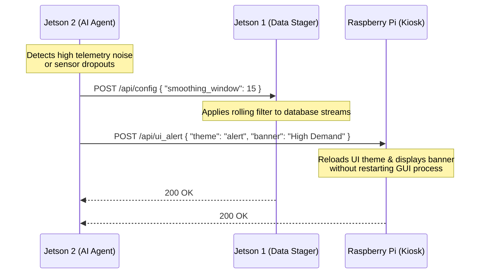

# Plan for Agentic Distributed Compute: Google AI Edge SDK Integration

This document details the architectural plan for utilizing the **Google AI Edge SDK** (formerly MediaPipe LLM Inference API / LiteRT) to run local **Gemma** models in a fully offline, multi-node edge environment. This design decouples real-time kiosk display logic from resource-intensive local inference and dynamic agent orchestration, replacing the cloud Vertex AI pipeline with cost-free, on-device Edge AI compute.

---

## 1. Overview of Google AI Edge SDK
The **Google AI Edge SDK** is Google's official developer kit for running machine learning models on-device (mobile, IoT, and edge servers). It utilizes **LiteRT** (formerly TensorFlow Lite) and **MediaPipe** to achieve high-performance hardware acceleration on local GPUs and NPUs.

### Key Benefits for the Jetson Orin Nano
* **Native GPU Execution:** Utilizes the GPU compiler delegate to run quantized model weights directly on the Jetson's Ampere cores.
* **Low Memory Footprint:** MediaPipe's engine is designed for resource-constrained environments, running `gemma-2b-it` with minimal RAM overhead.
* **Simple API Interface:** Avoids the complexity of full PyTorch/HuggingFace libraries, executing inference in just a few lines of clean Python.

---

## 1.1. Architectural Rationale: Pure Local Edge AI vs. Cloud Pipelines

Instead of using a cloud-based pipeline (e.g., uploading telemetry manifests to Google Cloud Storage and scheduling Vertex AI Batch Prediction predictions on Gemini 2.5 Flash), the system is designed to run entirely on local Edge AI resources for the following reasons:

* **Zero Transaction Cost:** Running inference on local Tegra Ampere cores eliminates Google Cloud token and storage usage costs, making the continuous 15-minute telemetry analysis free of charge.
* **On-Premises Privacy:** Household energy consumption data is highly granular and private. Utilizing local Gemma models ensures that no data leaves the local network.
* **Offline Resilience:** High-impact power grid events (such as winter storms, high demand alerts, or utility outages) are frequently accompanied by local network degradation or internet service failures. A local edge architecture ensures that the stager, GUI, and decision agent remain fully functional when the cloud is unreachable.
* **Unified Resource Optimization:** The three-node setup isolates the kiosk GUI (Raspberry Pi), telemetry calculation and backup database (Jetson #1), and LLM execution (Jetson #2), maximizing performance and preventing CUDA driver page-cache out-of-memory lockups on a single Tegra board.

---

## 2. System Architecture

To maintain a responsive visual experience, the workload is distributed across three physical nodes in your local network:
1. **Raspberry Pi (`rainforestpi`):** The Kiosk Display and Data Collection node. It drives the Tkinter GUI (`dashboard.py`), queries the local stager, and caches summary text locally.
2. **Jetson Orin #1 (`192.168.8.68`):** The Data Stager and processing server. It runs the HTTP stager service (`stage_local_summary.py`), executes DFT and signal math on synced database logs, and handles communication with the inference server.
3. **Jetson Orin #2 (`192.168.8.45` - New Node):** The Dedicated Inference Server. It hosts the Google AI Edge SDK (MediaPipe) LLM/VLM engine, offloading all GPU processing and avoiding memory exhaustion on the stager.

```mermaid
flowchart TD
    subgraph PiNode [Raspberry Pi Kiosk Node]
        UI[dashboard.py / Tkinter GUI]
        LocalCache[gemini_summary.json]
    end

    subgraph Jetson1 [Jetson Orin #1 (Data & Math Node)]
        Stager[stage_local_summary.py: port 5000]
        DB[(grid_history.db - Synced)]
    end

    subgraph Jetson2 [Jetson Orin #2 (Dedicated Inference Node)]
        API[FastAPI Server: port 8000]
        SDK[Google AI Edge SDK]
        GPU[Ampere GPU Core]
        Model[(gemma-2b-it-gpu.bin)]
    end

    UI -->|1. Polling: /api/analyze| Stager
    Stager -->|2. Read Telemetry| DB
    Stager -->|3. POST Prompt JSON| API
    API -->|4. Query LLM Engine| SDK
    SDK -->|5. Compute Acceleration| GPU
    GPU -->|6. Return Tokens| SDK
    SDK -->|7. Return Summary| API
    API -->|8. Return Response JSON| Stager
    Stager -->|9. Respond with Cache Data| UI
    UI -->|10. Render Background Text| LocalCache
```

---

## 3. Model Preparation
The Google AI Edge SDK requires models to be converted into a compatible flatbuffer `.bin` format containing the model weights, tokenizer, and execution graph.

### Step 1: Download the Base Weights
Download the Google Gemma-2B-IT model from Kaggle Models or Hugging Face.

### Step 2: Convert to MediaPipe Format
Use the Google AI Edge Model Converter to create the GPU-optimized task file:
```bash
# Install the converter tool
pip install mediapipe

# Run the converter on the downloaded PyTorch/Safetensors weights
python3 -m mediapipe.tasks.python.genai.converter \
    --input_ckpt=./gemma-2b-it/ \
    --output_dir=./converted_models/ \
    --backend=gpu
```
> [!NOTE]
> This compiles a `gemma-2b-it-gpu.bin` file containing the 4-bit quantized model optimized for the Jetson GPU delegate.

---

## 4. Programming Model & SDK Code Paradigm

The Google AI Edge SDK (specifically the MediaPipe GenAI LlmInference task API) uses a specific programming model that differs from standard HuggingFace or Ollama architectures. To build a highly reliable edge service, the code must adhere to these patterns:

### A. Engine Configuration & Options
The engine is parameterized via `genai.LlmInferenceOptions`. On the Jetson, these values must match the memory bounds of the device:
* `model_path`: A local string pointing to the compiled `.bin` flatbuffer file.
* `max_tokens`: Total output sequence budget (must be bounded, e.g., 512–1024, to prevent infinite loops).
* `temperature`: Clamped to `0.2` or below for deterministic mathematical outputs.
* `top_k`: Kept to default `40` to restrict the token pool.

```python
options = genai.LlmInferenceOptions(
    model_path="/path/to/gemma-2b-it-gpu.bin",
    max_tokens=1024,
    temperature=0.1,
    top_k=40
)
```

### B. Safe Context Management (RAII Pattern)
The MediaPipe C++ runtime allocates dedicated memory pages directly on the Tegra GPU. To prevent memory leaks, you must manage the engine context. In standalone scripts, use the context manager:
```python
with genai.LlmInference.create_from_options(options) as generator:
    result = generator.generate("Analyze the telemetry: ...")
    print(result)
```
On FastAPI startups, if the engine is kept persistent, the developer must call `generator.close()` inside the `@app.on_event("shutdown")` hook to prevent the CUDA context from hanging in zombie states on the Jetson.

### C. Execution Methods: Synchronous vs. Asynchronous Streaming
The SDK supports two execution models:
1. **Synchronous Generation (`generate`):** Blocks execution until the full sequence is complete. Perfect for API request-response patterns (e.g. stager logs).
2. **Asynchronous/Streaming Generation (`generate_async`):** Takes a callback function that yields tokens as they are generated. 
```python
def token_callback(token: str, done: bool):
    print(token, end="", flush=True)
    if done:
        print("\n=== Generation Complete ===")

# Create options with the callback registered
options_async = genai.LlmInferenceOptions(
    model_path="model.bin",
    result_listener=token_callback
)

with genai.LlmInference.create_from_options(options_async) as generator:
    generator.generate_async("Describe PSE Flex event performance:")
    # Prevent main thread exit while generating
    time.sleep(5)
```

### D. Single-Threaded Constraints & Thread Safety
> [!CAUTION]
> The underlying MediaPipe LLM Inference C++ engine is **not thread-safe**. 
> Attempting to query the same `LlmInference` instance from multiple concurrent threads will result in segfaults or corrupted memory outputs.
> **Fix:** Wrap the model call in a thread-safe mutex lock (e.g., Python's `threading.Lock`) within the FastAPI server. This serializes stager requests and prevents parallel GPU pipeline collisions.
```python
from threading import Lock
gpu_lock = Lock()

def query_model(prompt: str) -> str:
    with gpu_lock:
        return generator.generate(prompt)
```

---

## 5. Serving the Model via FastAPI
To decouple the inference workload, run a lightweight FastAPI server on the dedicated Jetson. This server loads the Google AI Edge model into GPU memory once and exposes an API endpoint.

Save the following code as `ai_edge_server.py` on the inference Jetson:

```python
import os
import logging
from typing import List, Optional
from fastapi import FastAPI, HTTPException
from pydantic import BaseModel
import uvicorn

# Import the Google AI Edge / MediaPipe GenAI tasks
import mediapipe as mp
from mediapipe.tasks.python import genai

# Configure logging
logging.basicConfig(level=logging.INFO, format="%(asctime)s - %(levelname)s - %(message)s")

# Global variables for the inference engine
MODEL_PATH = os.environ.get("AI_EDGE_MODEL_PATH", "./converted_models/gemma-2b-it-gpu.bin")
generator: Optional[genai.LlmInference] = None

app = FastAPI(title="Google AI Edge SDK Server", version="1.0.0")

class PromptRequest(BaseModel):
    prompt: str
    max_tokens: Optional[int] = 1024
    temperature: Optional[float] = 0.2
    top_k: Optional[int] = 40

class PromptResponse(BaseModel):
    response: str
    status: str

@app.on_event("startup")
def load_model():
    """Loads the model into GPU memory during server startup."""
    global generator
    if not os.path.exists(MODEL_PATH):
        logging.error(f"Model file not found at path: {MODEL_PATH}")
        raise FileNotFoundError(f"Missing model binary at {MODEL_PATH}")
    
    logging.info(f"Initializing Google AI Edge SDK with model: {MODEL_PATH}...")
    try:
        # Define LLM Inference options mapping straight to the GPU backend
        options = genai.LlmInferenceOptions(
            model_path=MODEL_PATH,
            max_tokens=1024,
            temperature=0.2,
            top_k=40
        )
        generator = genai.LlmInference.create_from_options(options)
        logging.info("Model loaded successfully onto GPU.")
    except Exception as e:
        logging.critical(f"Failed to initialize MediaPipe LLM engine: {e}")
        raise e

@app.on_event("shutdown")
def unload_model():
    """Cleans up GPU context allocations on server shutdown."""
    global generator
    if generator:
        logging.info("Closing Google AI Edge SDK engine context...")
        generator.close()

@app.post("/generate", response_model=PromptResponse)
async def generate_summary(payload: PromptRequest):
    """Processes incoming prompts using the local MediaPipe LLM Engine."""
    global generator
    if not generator:
        raise HTTPException(status_code=503, detail="LLM engine is not initialized.")
    
    try:
        logging.info("Processing inference request...")
        # Execute synchronous inference on the compiled GPU graph
        response_text = generator.generate(payload.prompt)
        return PromptResponse(response=response_text, status="success")
    except Exception as e:
        logging.error(f"Inference error: {e}")
        raise HTTPException(status_code=500, detail=f"Inference execution failed: {str(e)}")

if __name__ == "__main__":
    uvicorn.run("ai_edge_server:app", host="0.0.0.0", port=8000, reload=False)
```

---

## 6. Integrating with the Dashboard Stager
Once the server is running on your network (e.g. at `http://192.168.8.45:8000`), the dashboard stager script can direct its requests to this endpoint instead of Ollama.

Here is a snippet showing how `stage_local_summary.py` can be configured to interact with the server:

```python
import requests
import json
import logging

AI_EDGE_ENDPOINT = "http://192.168.8.45:8000/generate"

def query_ai_edge_sdk(prompt: str) -> str:
    """Submits the formatted telemetry prompt to the Google AI Edge SDK Server.

    Args:
        prompt: The constructed plain text prompt containing grid telemetry.

    Returns:
        The generated text summary string.
    """
    payload = {
        "prompt": prompt,
        "max_tokens": 512,
        "temperature": 0.2
    }
    headers = {"Content-Type": "application/json"}
    
    try:
        logging.info("Sending request to Google AI Edge SDK server...")
        response = requests.post(AI_EDGE_ENDPOINT, json=payload, headers=headers, timeout=180)
        response.raise_for_status()
        result = response.json()
        return result.get("response", "")
    except requests.exceptions.RequestException as e:
        logging.error(f"Failed to query AI Edge SDK Server: {e}")
        # Fall back to cloud Vertex AI or return cache
        raise e
```

---

## 7. Recommendations & Troubleshooting

> [!TIP]
> **GPU Delegate Mappings:** Ensure that the user running the FastAPI daemon is added to the `video` and `render` system groups on the Jetson to grant direct permission to the hardware CUDA sockets (`sudo usermod -aG video,render $USER`).

> [!WARNING]
> **Temperature Bounds:** When running deterministic mathematical summaries, keep `temperature` clamped to `0.2` or lower to prevent the model from hallucinating daily totals that deviate from the raw database records.

---

## 8. Dynamic Agent-to-Agent Signaling & Adaptability

To handle a variable telemetry environment (sensor dropouts, line noise, network latency), the autonomous agent running on **Jetson #2** acts as a coordinator, dynamically sending configuration modifications, data patches, and UI overrides to **Jetson #1** (Stager) and the **Raspberry Pi** (Kiosk Display).

### A. Config-on-the-Fly Architecture (Recommended)
Instead of the secondary Jetson generating and executing raw Python code directly on the Raspberry Pi or the stager—which risks system crashes or memory leaks—the agent outputs **structured configuration schemas (JSON)**. 



### B. Adaptive Data Imputation
If a local telemetry connection fails (e.g., SolarEdge cloud API timeout or EMU-2 serial disconnect), the agent can:
1. Load historical diurnal curves or run localized predictive models.
2. Compute estimated metrics for the offline period.
3. Write the estimated rows to a distinct `imputed_history` table in the database replica on **Jetson #1** so that stager summaries and dashboard graphs remain continuous.

### C. Safe Code Synthesis (Sandboxing)
If the agent must write custom Python scripts on the fly (e.g., to process a newly designed data log format or execute a custom mathematical model requested by the operator):
* **No Direct Execution on Pi:** The code must never run directly on the kiosk thread.
* **Process Isolation:** Save the generated code to a temporary file on **Jetson #2** and run it inside a sandboxed subprocess with strict resource bounds:
  ```bash
  timeout 5s python3 -E /tmp/synthesized_script.py
  ```
* **Fallback Gate:** If the script errors out or times out, the stager discards it and falls back to a deterministic baseline, protecting the downstream dashboard.

---

## 9. Operational User Journeys

The following user journeys illustrate how this multi-node, agent-driven edge system handles real-world scenarios:

### Journey 1: Adaptive Filtering of Noisy Telemetry
* **Scenario:** The local power meter interface suffers a loose serial link, injecting random spike anomalies and mathematical noise into the hourly telemetry logs.
* **Agent Action:** 
  1. The agent on Jetson #2 runs periodic anomaly checks (`snr_analysis.py`) and detects a sudden drop in signal-to-noise ratio.
  2. The agent sends a config payload to the primary kiosk: `{"rolling_median_filter": true, "filter_window": 9}`.
  3. The primary Jetson immediately applies a median filter to the active Matplotlib data arrays.
* **Kiosk Visual Result:** The jagged, anomaly-ridden graph is dynamically smoothed on the screen, keeping the visual data legible for the home operator without requiring manual code changes.

### Journey 2: Peak Demand Event Visual Overrides
* **Scenario:** Local grid demand spikes to a critical threshold (e.g., EV charging + HVAC on a hot summer evening).
* **Agent Action:**
  1. The agent parses the telemetry database, calculates a steep derivative (slope) on load growth, and forecasts a grid overload.
  2. The agent issues a UI alert command to Jetson #1: `{"theme_override": "peak_warning", "alert_banner": "Critical Grid Load Detected"}`.
  3. The Tkinter window on the primary display intercepts this config, swapping background colors to a warning palette and displaying a warning banner.
* **Kiosk Visual Result:** The kiosk screen transitions to a bold warning theme, alerting the homeowner to postpone heavy appliance usage.

### Journey 3: AI-Assisted Sensor Imputation
* **Scenario:** The household internet drops, causing the SolarEdge cloud API scraper to fail and leaving a gap in the solar generation history database.
* **Agent Action:**
  1. The agent on Jetson #2 detects the API failure.
  2. It queries historical database logs to fetch the average generation curve for similar weather patterns at this time of year.
  3. It generates an imputed solar data stream and uploads it to the secondary telemetry table on Jetson #1.
* **Kiosk Visual Result:** The kiosk display renders the missing solar production curve as a dashed line labeled *"Imputed/Estimated"*, preserving graph continuity instead of showing blank graphs.

### Journey 4: Interactive Dynamic Plot Customization
* **Scenario:** The operator logs in remotely and wants to visualize a custom relationship (e.g., the Fourier Transform bimodal sinus rhythms of grid demand over the last 14 days).
* **Agent Action:**
  1. The operator inputs a text request: *"Show me the bimodal frequency spectrum of my grid usage over the past 2 weeks."*
  2. The agent on Jetson #2 generates a custom Matplotlib Python script to compute the FFT, filter out the noise, and save a JPEG.
  3. The script is executed inside a sandboxed subprocess on Jetson #2.
  4. Once validated, Jetson #2 copies the generated image file to the primary Jetson's cache directory.
* **Kiosk Visual Result:** The kiosk display rotates to slide 2, displaying the custom bimodal spectrum visualization dynamically compiled by the agent.

---

## 10. Architectural Assessment

An evaluation of the three-node distributed agentic compute design highlights the following core features, risks, and recommendations:

### A. Strengths & Advantages
* **Workload Isolation:** Decoupling the GUI thread from heavy LLM/VLM processing ensures the Matplotlib/Tkinter interface remains completely fluid on the Raspberry Pi without frame drops.
* **Unified Memory (UMA) Optimization:** Restricting Jetson #2 solely to headless inference frees up the unified memory allocation completely. This allows it to allocate ~7 GB of VRAM to Google's Gemma models without CPU swap thrashing or CUDA allocation crashes.
* **Resilience to WAN Outages:** By hosting the Google AI Edge SDK locally, the system maintains 100% functionality (visual displays, data backups, stager calculations, and agent decisions) during local storms or internet failures.
* **Privacy Controls:** Raw, highly granular home power metrics are kept 100% local, avoiding data transfers to third-party cloud storage or prediction pipelines.

### B. Bottlenecks & Mitigation Options
* **Network Hostname Dependencies:** 
  * *Risk:* If local DHCP lease assignments change the IP addresses of the Pi or Jetsons, the connection strings will break.
  * *Mitigation:* Ensure that static IP reservations or local hostname mapping (e.g., `rainforestpi.local`, `nvjetson1.local`, `nvjetson2.local`) are configured in the network router.
* **Telemetry Data Staleness:**
  * *Risk:* If the background `rsync` script fails, Jetson #1 will run calculations on stale telemetry databases.
  * *Mitigation:* Implement a metadata age check in `stage_local_summary.py` that checks the file modification timestamp (`mtime`) of `grid_history.db`. Trigger a warning status if the database has not updated in over 30 minutes.
* **Deployment Maintenance Overhead:**
  * *Risk:* Managing separate scripts and services across three different Linux environments (Raspberry Pi OS and two JetPack distributions) is complex.
  * *Mitigation:* Leverage the centralized `redeploy.sh` script to orchestrate code staging, service reloads, and unit testing. Run the FastAPI wrapper inside a Docker container on Jetson #2 to ensure clean sandbox boundaries.
