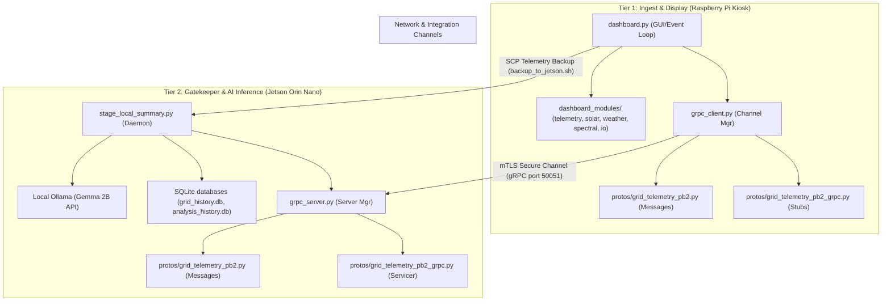

# Plan for gRPC Migration: Raspberry Pi & Jetson Edge

This document outlines the design and implementation plan for replacing the HTTP REST APIs in the active microgrid dashboard setup with a high-performance, contract-defined **gRPC** protocol.

---

## Current Execution Status & Checklist (Do-a-Thing, Write-a-Thing)

- `[x]` **Task 1: Protobuf Contract Specification** -> Refactored [grid_telemetry.proto](file:///protos/grid_telemetry.proto) with Google Timestamp and structured spectral/LLM metrics. (Completed)
- `[x]` **Task 2: Database Setup & Migration** -> Created and executed [migrate_local_db.py](file:///migrate_local_db.py) to migrate legacy telemetry logs to SQLite `backups/grid_history.db` and initialize `backups/analysis_history.db`. Successfully deployed and executed on the Jetson Orin Nano edge server to initialize the schema and verify 115,798 telemetry records. (Completed)
- `[x]` **Task 3: Security Directory Setup** -> Configured `Auth/certs` for credentials storage and added paths to `.gitignore`. (Completed)
- `[x]` **Task 4: Cryptographic Key Generation** -> Created [generate_certs.py](file:///tests/emulation/generate_certs.py) and generated CA, server, and client certs. (Completed)
- `[x]` **Task 5: Modular Client Architecture** -> Created client module [grpc_client.py](file:///dashboard_modules/grpc_client.py) to decouple gRPC client operations from UI code. (Completed)
- `[x]` **Task 6: Local virtual environment dependencies** -> Installed `grpcio==1.81.1` and `grpcio-tools==1.81.1` successfully via precompiled wheels. (Completed)
- `[x]` **Task 7: Modular Server Architecture** -> Created server module [grpc_server.py](file:///dashboard_modules/grpc_server.py) to decouple gRPC server operations from API server code. (Completed)
- `[x]` **Task 8: Protobuf Compilation** -> Compiled `.proto` into Python stub files using local `protoc` compiler. (Completed)
- `[x]` **Task 9: Pipeline Emulation Testing** -> Ran loopback tests and full local edge pipeline emulation successfully. (Completed)
- `[x]` **Task 10: Codebase Migration** -> Refactoring [stage_local_summary.py](file:///stage_local_summary.py) to extract math/prompts, starting the gRPC server wrapper, and updating [dashboard.py](file:///dashboard.py) update loop. (Completed)
- `[x]` **Task 11: Deployment automation** -> Refactored [redeploy.sh](file:///redeploy.sh) to automate local gRPC stub builds, certificate replication, and `.env` pathing. (Completed)
- `[x]` **Task 12: Visual & Drawing Validation** -> Execute `./plot_and_open.sh` and verify Matplotlib layout drawings locally prior to kiosk push. (Completed)
- `[x]` **Task 13: Final Code Review & LGTM** -> Present a detailed diff to the user for explicit deployment approval. (Completed)
- `[x]` **Task 14: Public Staging & Code Publication** -> Successfully initialized public staging git repository, configured [example_auth/](file:///example_auth) template directories, added [.agents/](file:///.agents) guidelines, and executed git commit/push of release `v3.6.0` to the remote public repository. (Completed)


---

---

## 1. Goal Description
To migrate communication between the **Raspberry Pi (Kiosk Display)** and the existing **Jetson Orin Nano (Data & AI Server)** from HTTP/JSON REST endpoints to **gRPC/Protobuf**, aligning the system with the **Project Antigravity** specifications.

This plan targets **only the current active edge hardware** (the Pi and the single existing Jetson #1), without assuming a second Jetson unit is present. The architecture remains fully ready to extend to a third node (Inference Server) in the future.

This change will:
* **Enforce API Contracts:** Use strictly defined `.proto` files to govern telemetry payloads and communication parameters.
* **Enable Real-Time Streaming:** Support gRPC server-side streaming to flow generated AI tokens from Ollama on the Jetson back to the Pi display in real-time, rather than waiting for a single large blocked response.
* **Reduce Latency & Payload Overhead:** Replace text-based JSON serialization with binary Protobuf serialization.

## 1.1. Project Antigravity System Architecture (Heterogeneous Edge-to-Cloud)
The gRPC implementation directly enables Project Antigravity's three-tiered, energy-optimized orchestration:
* **Tier 1: Ingest & Preprocessing (Raspberry Pi):** Continuously polls EMU-2 grid telemetry. Instead of using chronological timers, it applies FFT spectral analysis (NumPy/SciPy) locally to compute the dynamic period boundary of the active cycle, slicing the telemetry buffer into phase-aligned batches.
* **Tier 2: Edge Inference & Anomaly Detection (NVIDIA Jetson Orin Nano):** Receives these phase-aligned batches directly into unified memory. Executes a local batch inference pass (Gemma model, strictly memory-clamped to `num_ctx: 2048` within the 8GB limit). Normal batches return to sleep; anomalous batches trigger escalation.
* **Tier 3: Cloud Escalation (Cloud AI Resources):** Tier 2 constructs a dense context envelope containing only the anomalous historical window, invoking cloud resources for deep analysis without keeping a continuous cloud connection open.

## 1.2. Architecture & Data Flow Dependency Graph



---

## 2. User Review Required

> [!IMPORTANT]
> **Emulation Methodology:** No code will be deployed or tested on the live Raspberry Pi or Jetson hardware until the entire gRPC pipeline has been fully emulated and verified locally on the developer machine using mock database snapshots.

> [Spacer]
> [!IMPORTANT]
> **Dependencies Pinned:** Installing gRPC requires adding `grpcio` and `grpcio-tools` to `requirements.txt`. These must be strictly pinned to exact versions compatible with the Python runtimes on both nodes (ARM64 on Pi/JetPack, and macOS/Linux on development machines).

---

## 2.1. Telemetry Storage Schemas & Mappings

To ensure that the gRPC Protobuf messages map correctly to the active data structures and that local emulation matches production, the schemas for the SQLite database and all flat-file telemetry CSVs are defined below:

### A. SQLite Grid History Database (`grid_history.db`)
* **Path**: `backups/grid_history.db` on Jetson, read directly from the Pi.
* **Interval**: Polled from the Rainforest EMU-2 serial interface every 15 seconds.
* **Schema**:
  ```sql
  CREATE TABLE grid_history (
      timestamp TEXT PRIMARY KEY, -- ISO 8601 naive timestamp (e.g., "2026-06-14T09:30:15")
      kw REAL NOT NULL            -- Active grid demand in kW (+ for grid import, - for solar export)
  );
  CREATE INDEX idx_grid_timestamp ON grid_history(timestamp);
  ```

### A.1. SQLite Analysis History & Anomaly Log Database (`analysis_history.db`)
* **Path**: `backups/analysis_history.db` on Jetson (Tier 2 Node).
* **Description**: Staggered logs of completed local evaluations. Serves as a persistent queue and audit ledger for Tier 3 Cloud escalation.
* **Schema**:
  ```sql
  CREATE TABLE analysis_history (
      timestamp TEXT PRIMARY KEY,          -- Time of analysis generation (ISO 8601 string)
      baseline_timestamp TEXT NOT NULL,    -- Timestamp of the baseline context used
      baseline_text TEXT,                  -- Raw baseline context text
      summary_text TEXT,                   -- Completed local LLM live delta summary
      dft_explanation TEXT,                -- Completed local LLM DFT explanation
      delta_import REAL NOT NULL,          -- Net grid imports (kWh)
      delta_export REAL NOT NULL,          -- Net grid exports (kWh)
      delta_peak REAL NOT NULL,            -- Peak grid demand (kW)
      delta_solar REAL NOT NULL,           -- Combined solar production (kWh)
      delta_se_solar REAL NOT NULL,        -- SolarEdge solar production (kWh)
      delta_ch_solar REAL NOT NULL,        -- Chillicon solar production (kWh)
      delta_bat_charge REAL NOT NULL,      -- Battery energy charged (kWh)
      delta_bat_discharge REAL NOT NULL,    -- Battery energy discharged (kWh)
      delta_se_load REAL NOT NULL,         -- Appliance load energy (kWh)
      se_load_min REAL NOT NULL,           -- Min appliance load power (kW)
      se_load_max REAL NOT NULL,           -- Max appliance load power (kW)
      se_load_avg REAL NOT NULL,           -- Avg appliance load power (kW)
      expected_temp_max REAL,              -- Forecasted max temp (°C)
      expected_cloud_cover REAL,           -- Forecasted cloud cover (%)
      spectral_metrics_json TEXT,          -- Serialized JSON of all calculated FFT/DFT/SNR metrics
      escalation_status INTEGER DEFAULT 0, -- Gating: 0 = Normal, 1 = Escalated to Tier 3, 2 = Pending Retry
      escalation_timestamp TEXT            -- Time of cloud handover (ISO 8601)
  );
  CREATE INDEX idx_analysis_escalation ON analysis_history(escalation_status);
  ```

### B. Legacy Grid History CSV (`grid_history.csv`)
* **Path**: `backups/grid_history.csv` (Legacy flat-file storage).
* **Migration**: On first boot, the stager/dashboard migrates this legacy file automatically into the SQLite database.
* **Schema (Headerless, Comma-Separated)**:
  1. `timestamp` (TEXT): ISO 8601 string (e.g., `2026-05-24T12:46:28`)
  2. `kw` (REAL): Active grid demand in kW (signed)
* **Example**:
  ```csv
  2026-05-24T12:46:28,-4.482
  ```

### C. SolarEdge PV Generation Logs (`solaredge_history.csv`)
* **Path**: `backups/solaredge_history.csv`
* **Interval**: Polled from SolarEdge API `currentPowerFlow` PV endpoint every 15 minutes.
* **Schema (Headerless, Comma-Separated)**:
  1. `timestamp` (TEXT): ISO 8601 string (e.g., `2026-05-26T08:57:12.051817`)
  2. `pv_power_kw` (REAL): Solar PV generation in kW (unsigned)
* **Example**:
  ```csv
  2026-05-26T08:57:12.051817,0.138
  ```

### D. SolarEdge Battery Logs (`solaredge_battery_history.csv`)
* **Path**: `backups/solaredge_battery_history.csv`
* **Interval**: Polled from SolarEdge API `currentPowerFlow` storage endpoint every 15 minutes.
* **Schema (Headerless, Comma-Separated)**:
  1. `timestamp` (TEXT): ISO 8601 string (e.g., `2026-05-26T17:47:35.527497`)
  2. `battery_power_kw` (REAL): Signed battery flow in kW (+ for discharging, - for charging)
  3. `battery_soc_percent` (REAL): State of Charge in % (0.0 to 100.0)
* **Example**:
  ```csv
  2026-05-26T17:47:35.527497,3.630,69.0
  ```

### E. SolarEdge Flow History Logs (`solaredge_flow_history.csv`)
* **Path**: `backups/solaredge_flow_history.csv`
* **Interval**: Polled from SolarEdge API `currentPowerFlow` flow connections every 15 minutes.
* **Schema (Headerless, Comma-Separated)**:
  1. `timestamp` (TEXT): ISO 8601 string (e.g., `2026-06-04T20:45:29.533345`)
  2. `pv_power_kw` (REAL): Real-time solar generation in kW
  3. `load_power_kw` (REAL): Real-time household consumption (load_power) in kW (read from index 2 in `solar.py` and `stage_local_summary.py`)
  4. `grid_import_kw` (REAL): Real-time grid import power in kW
  5. `grid_export_kw` (REAL): Real-time grid export power in kW
* **Example**:
  ```csv
  2026-06-04T20:45:29.533345,0.000,1.010,1.980,0.000
  ```

### F. Chillicon PV Production Logs (`chilicon_history.csv`)
* **Path**: `backups/chilicon_history.csv`
* **Interval**: Polled from Chillicon Microgrid Cloud AJAX `fetchOwnerUpdate` every 15 minutes.
* **Schema (Headerless, Comma-Separated)**:
  1. `timestamp` (TEXT): ISO 8601 string (e.g., `2026-05-27T08:24:58.689909`)
  2. `power_kw` (REAL): Micro-inverter generation power in kW
  3. `lifetime_wh` (REAL): Cumulative lifetime energy in Wh
* **Example**:
  ```csv
  2026-05-27T08:24:58.689909,0.037,21735.1
  ```

---

## 3. Open Questions

> [!IMPORTANT]
> 1. **Streaming vs. Unary Summaries:** Do you want the kiosk UI to render the AI summary text streaming in letter-by-letter as it is generated, or should we stick to unary calls where the entire text block displays at once? *(We highly recommend streaming for a premium kiosk aesthetic).*
> 2. **Network Port:** We will standardize on the default gRPC port `50051` for the Jetson stager service. Does this conflict with any other services running on your Jetson?

---

## 4. Proposed Changes

We will group the changes into clean, separate components:

### Component A: Protobuf Contracts (`[MODIFY] protos/`)
We will modify the existing Protobuf contract file to fully align with the schema of the multi-source telemetry data, import standard timestamps, and support phase-aligned batching:

#### [MODIFY] [grid_telemetry.proto](file:///Users/treven/Documents/rainforest-emu2-grid-dashboard/protos/grid_telemetry.proto)
Refactors the existing Protobuf structure to map all active CSV columns, SQLite telemetry values, and phase-aligned batches:
* **Imports:** `import "google/protobuf/timestamp.proto";` for efficient binary timestamp serialization.
* Update `TelemetryRequest` to contain:
  ```protobuf
  message TelemetryRequest {
    google.protobuf.Timestamp timestamp = 1; // Efficient binary 64-bit/32-bit timestamp
    double grid_usage_kw = 2;         // Matches grid_history (SQLite/CSV)
    double solaredge_pv_kw = 3;       // Matches solaredge_history (CSV)
    double solaredge_battery_kw = 4;  // Matches solaredge_battery_history battery_power_kw
    double solaredge_battery_soc = 5; // Matches solaredge_battery_history battery_soc_percent
    double solaredge_load_kw = 6;     // Matches solaredge_flow_history load_power_kw (index 2)
    double solaredge_import_kw = 7;   // Matches solaredge_flow_history grid_import_kw (index 3)
    double solaredge_export_kw = 8;   // Matches solaredge_flow_history grid_export_kw (index 4)
    double chilicon_pv_kw = 9;        // Matches chilicon_history power_kw
    double chilicon_lifetime_wh = 10; // Matches chilicon_history lifetime_wh
  }
  ```
* Introduce `TelemetrySlice` to support Project Antigravity's phase-aligned batching:
  ```protobuf
  message TelemetrySlice {
    string slice_id = 1;
    google.protobuf.Timestamp start_timestamp = 2;
    google.protobuf.Timestamp end_timestamp = 3;
    double dft_period_hours = 4;            // Dynamic period calculated by Tier 1 FFT
    repeated TelemetryRequest readings = 5;  // Chronological batch of telemetry
    SpectralMetrics spectral_metrics = 6;   // Spectral metrics calculated on edge Tier 1
  }
  ```
* Introduce `SpectralMetrics` representing calculated FFT, DTF, and SNR values:
  ```protobuf
  message SpectralMetrics {
    double solar_24h_amp = 1;
    double solar_24h_peak_hour = 2;
    double grid_24h_amp = 3;
    double grid_12h_amp = 4;
    double grid_12h_peak_hour = 5;
    double grid_bimodal_ratio = 6;
    
    // Rhythm SNR (Signal-to-Noise Ratio) in dB
    double grid_24h_snr_db = 7;
    double grid_12h_snr_db = 8;
    double solar_24h_snr_db = 9;
    double consumption_24h_snr_db = 10;
    double consumption_12h_snr_db = 11;
    
    // Time-domain slopes (rate of change)
    double solar_slope = 12;
    double grid_slope = 13;
    
    // Raw spectral coefficients for Matplotlib layout rendering
    repeated double freqs = 14;
    repeated double grid_amp_spec = 15;
    repeated double solar_amp_spec = 16;
    repeated double consumption_amp_spec = 17;
  }
  ```
* Introduce `AnalysisRequest` representing the input prompt contexts and client parameters:
  ```protobuf
  message AnalysisRequest {
    google.protobuf.Timestamp baseline_timestamp = 1; // Baseline timestamp context
    string baseline_text = 2;                         // Current baseline summary text
    int32 batch_interval_hours = 3;                   // Evaluation window size in hours (default: 4)
  }
  ```
* Introduce `AnalysisResponse` containing quantitative metrics, weather variables, spectral structures, and completed LLM summaries:
  ```protobuf
  message AnalysisResponse {
    google.protobuf.Timestamp timestamp = 1;
    string baseline_text = 2;                         // Baseline summary text (fresh or updated)
    google.protobuf.Timestamp baseline_timestamp = 3; // Baseline timestamp (fresh or updated)
    string summary_text = 4;                          // Completed LLM live delta summary text
    string dft_explanation = 5;                       // Completed LLM DFT explanation text
    
    // Computed quantitative metrics
    double delta_import = 6;
    double delta_export = 7;
    double delta_peak = 8;
    double delta_solar = 9;
    double delta_se_solar = 10;
    double delta_ch_solar = 11;
    double delta_bat_charge = 12;
    double delta_bat_discharge = 13;
    double delta_se_load = 14;
    
    // Weather metrics
    double expected_temp_max = 15;
    double expected_cloud_cover = 16;
    
    // Spectral and frequency-domain structure
    SpectralMetrics spectral_metrics = 17;
  }
  ```
* Introduce `AnalysisStreamResponse` supporting real-time token streaming from local Ollama/Gemma:
  ```protobuf
  message AnalysisStreamResponse {
    // The first message in the stream contains metadata and computed analysis numbers
    optional AnalysisResponse initial_analysis = 1;
    
    // Subsequent messages contain token chunks of the generated summaries as they stream in
    // Note: Tokens are buffered server-side (3-5 tokens or word boundaries) to reduce packet overhead
    string summary_token_chunk = 2;
    string dft_token_chunk = 3;
  }
  ```
* Introduce `TelemetryResponse` for ingest confirmation:
  ```protobuf
  message TelemetryResponse {
    bool success = 1;
    string message = 2;
  }
  ```
* Define service `GridTelemetryService` to ingest dynamic slices, verify anomalies, and fetch analysis summaries:
  ```protobuf
  service GridTelemetryService {
    // Phase-aligned telemetry batch handover from Tier 1 to Tier 2
    rpc EvaluateTelemetrySlice(TelemetrySlice) returns (TelemetryResponse);
    
    // Server-streaming call to stream Ollama/Gemma generated tokens back to Pi Kiosk
    rpc GetTelemetryAnalysisStream(AnalysisRequest) returns (stream AnalysisStreamResponse);
  }
  ````
### Component A.1: Mutual TLS (mTLS) Security Configuration & Clock Sync
To enforce zero-trust security between Tier 1 (Pi) and Tier 2 (Jetson) local networks:
* **Disk/SSH Handshake Bypass:** Bypasses standard SSH/disk latency overhead to preserve hardware longevity by conducting memory-to-memory gRPC transfers.
* **Cryptographic Authentication:** Generate self-signed root, server, and client certificates. Both gRPC client and server will perform mutual validation during the TLS handshake.
* **Strict Clock Synchronization (NTP):** Because edge hardware is highly prone to clock drift if disconnected from the internet, instant failures will occur during mTLS certificate validation. To prevent this, the NVIDIA Jetson Orin Nano (Tier 2) acts as the local NTP server for the Raspberry Pi (Tier 1) kiosk. Synchronization is verified before gRPC binding.

---

### Component B: Local Emulation Sandbox & Security Tooling (`[NEW] tests/emulation/`)
A completely isolated local testing environment to validate the gRPC communication under real-world constraints.

#### [NEW] [mock_database.py](file:///Users/treven/Documents/rainforest-emu2-grid-dashboard/tests/emulation/mock_database.py)
Generates mock SQLite databases matching your PSE microgrid database schema to simulate live serial logging inputs.

#### [NEW] [emulate_grpc_pipeline.py](file:///Users/treven/Documents/rainforest-emu2-grid-dashboard/tests/emulation/emulate_grpc_pipeline.py)
Spins up the local stager gRPC service locally on port 50051. It runs the emulation sequence of feeding mock data, querying via the gRPC client, and asserting correctness.

#### [NEW] [generate_certs.py](file:///Users/treven/Documents/rainforest-emu2-grid-dashboard/tests/emulation/generate_certs.py)
Generates CA, server, and client TLS/SSL certificates to enable secure mutual TLS (mTLS) authentication between the client and server.

#### [NEW] [test_grpc_contract.py](file:///Users/treven/Documents/rainforest-emu2-grid-dashboard/tests/emulation/test_grpc_contract.py)
Implements in-memory unit tests using `grpc_testing` to validate Protobuf message serialization and API contract constraints.

---

### Component C: Codebase Migration (`[MODIFY]`)
Source files and modules migrated to decoupled gRPC client-server telemetry streaming:

#### [MODIFY] [requirements.txt](file:///Users/treven/Documents/rainforest-emu2-grid-dashboard/requirements.txt)
Pin gRPC requirements:
* `grpcio==1.81.1`
* `grpcio-tools==1.81.1`

> [!WARNING]
> **ARM64 Compilation / OOM Prevention:** Pinning `grpcio` on ARM64 platforms (NVIDIA Jetson) can cause `pip` to compile massive C++ extensions from source if binary wheels are missing, resulting in OOM kernel kills.
> To deploy safely on the Jetson, execute:
> ```bash
> # Force pip to use binary wheels only (raises quick error if missing)
> pip install -r requirements.txt --only-binary=grpcio,grpcio-tools
> 
> # Alternatively, clamp compiler extension jobs to a single core if compiling from source:
> export GRPC_PYTHON_BUILD_EXT_COMPILER_JOBS=1
> pip install grpcio==1.81.1 grpcio-tools==1.81.1
> ```

#### [NEW] [migrate_local_db.py](file:///Users/treven/Documents/rainforest-emu2-grid-dashboard/migrate_local_db.py)
Initializes database tables and migrates legacy CSV grid telemetry records into SQLite `grid_history.db` and `analysis_history.db`.

#### [NEW] [grpc_client.py](file:///Users/treven/Documents/rainforest-emu2-grid-dashboard/dashboard_modules/grpc_client.py)
Implements the thread-safe gRPC client context manager to handle secure channels and parse response streams.

#### [NEW] [grpc_server.py](file:///Users/treven/Documents/rainforest-emu2-grid-dashboard/dashboard_modules/grpc_server.py)
Implements the gRPC service servicer to run parallel FFT/DFT analytics and stream local Gemma/Ollama response token chunks.

#### [MODIFY] [stage_local_summary.py](file:///Users/treven/Documents/rainforest-emu2-grid-dashboard/stage_local_summary.py)
Exposes the gRPC `TelemetryStagerService` alongside the FastAPI endpoints.

#### [MODIFY] [dashboard.py](file:///Users/treven/Documents/rainforest-emu2-grid-dashboard/dashboard.py)
Updates the local delta loop in Tkinter to call the secure gRPC client.

---

## 5. Verification Plan & "On the Wire" Testing Strategy

To validate gRPC interfaces, performance limits, and local rendering without deploying untested code to edge hardware, the testing pipeline is split into four progressive levels:

### Level 1: In-Memory Contract Validation (Python mock tests)
Before using network sockets, validate Protobuf serialization and channel bindings using `grpc_testing.server_from_dictionary()`.
* **Execution:**
  ```bash
  python3 -m unittest tests/emulation/test_grpc_contract.py
  ```
* **Assertion:** Confirm that SQLite tables parse, serialize into `TelemetrySlice`/`SpectralMetrics` message fields, and compile back to Python models without rounding errors or key mismatches.

### Level 2: Local "On the Wire" Plaintext Testing (Command Line)
Start the local stager daemon in plaintext mode (without TLS) in the background to verify loopback port binding and basic routing.
* **Execution:**
  ```bash
  # Start emulation daemon locally
  python3 tests/emulation/emulate_grpc_pipeline.py --plaintext &
  
  # Query services directly via grpcurl CLI
  grpcurl -plaintext localhost:50051 list
  
  # Trigger an AnalysisRequest stream and verify token chunks flow to stdout
  grpcurl -plaintext -d '{"baseline_text": "Awaiting baseline..."}' \
    localhost:50051 GridTelemetryService/GetTelemetryAnalysisStream
  ```

### Level 3: Mutual TLS (mTLS) Handshake & Clock Sync Verification
Verify zero-trust channel security by generating test certificates (`ca.crt`, `server.crt`, `server.key`, `client.crt`, `client.key`) and testing the secure handshake.
* **Execution:**
  ```bash
  # Attempt handshake using valid client credentials
  grpcurl -cacert ca.crt -cert client.crt -key client.key \
    -d '{"slice_id": "test_01"}' \
    localhost:50051 GridTelemetryService/EvaluateTelemetrySlice
    
  # Failure test (Explicitly check that requests without client certs are blocked):
  grpcurl -cacert ca.crt localhost:50051 GridTelemetryService/EvaluateTelemetrySlice
  ```
* **System Clock Check:** Verify local NTP clock offset on the Pi kiosk by executing `chronyc sources -v` to confirm synchronization with the Jetson local NTP server.

### Level 4: Load & Memory Confinement Verification
To ensure token buffer streams and incoming telemetry bursts do not exceed the Orin's physical memory boundaries or crash the edge daemon:
* **Execution (using ghz load generator):**
  ```bash
  ghz --insecure \
    --proto protos/grid_telemetry.proto \
    --call GridTelemetryService/EvaluateTelemetrySlice \
    -d '{"slice_id": "load_test"}' \
    -c 50 -n 1000 localhost:50051
  ```
* **Confinement Target:** Monitor memory usage via `htop` during load tests to verify RAM usage remains within JetPack unified memory boundaries and OOM is not triggered.

### Local Render Verification (Pre-Deployment)
> [!IMPORTANT]
> **Mandatory Local Render Rule:** Before committing or pushing code to kiosks/servers, we must verify the offline Matplotlib and Tkinter layout drawing by running:
> * `./plot_and_open.sh` / `render_local_plot.py`
> 
> Assert that:
> 1. Slide 1 and Slide 2 generate clean screenshots (`dashboard_preview.jpeg`, `dashboard_preview_slide2.jpeg`) with correct alignments and watermarks.
> 2. Diurnal/semi-diurnal DFT curves, expected solar weather modulation, and stacked actual/expected bars render accurately.
> 3. Verify that the offline viewer functions normally when simulated with phase-aligned sliced database snapshots.

### CLI Flag & Shell Script Validation Strategy
- **Defensive CLI Logic**: To guarantee that changes to launch shell scripts (`.sh`) do not lead to runtime crashes when forwarding arguments (`"$@"`), all argument-handling blocks in `dashboard.py`, `render_local_plot.py`, and `stage_local_summary.py` use defensive coding techniques:
  - Boolean flag checks use simple substring tests (`"flag" in sys.argv`) to safely evaluate presence or absence.
  - Parameter-value flags (like `--port=` and `--history-hours=`) are evaluated in `try...except ValueError` blocks to capture missing/malformed inputs and gracefully fall back to default values.
- **Excluded CLI Flags from Headless Test Runs**: Headless unit tests bypass CLI arguments by mock-patching initialization (e.g. `@patch.object(GridDashboard, '__init__')`), ensuring that test environments run cleanly without spawning serial or networking background threads.

### UAT Environment Focus: Local Gemma & gRPC Integration
- **De-prioritizing Gemini**: Because the UAT environment no longer runs remote Gemini API calls, Gemini-based integration retry/backoff tests in `tests/test_parser.py` are explicitly marked with `@pytest.mark.skip(reason="UAT environment no longer runs Gemini")`.
- **Gemma & gRPC Testing**: Verification is focused entirely on local Gemma/Ollama generation pipelines and secure gRPC contracts (`tests/emulation/test_grpc_contract.py`), matching the Tier 1/Tier 2 hardware realities of the decoupled edge deployment.

