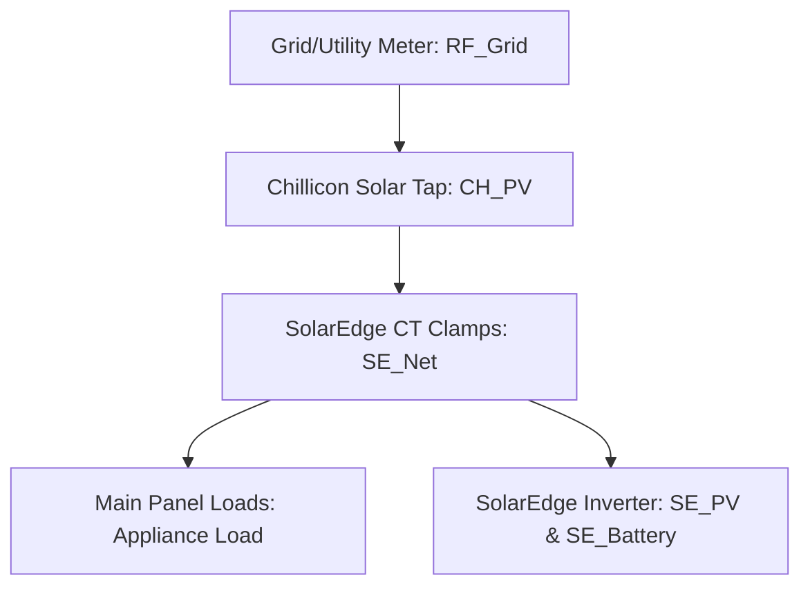

# Appliance Load & Grid Telemetry Accuracy Validation Report

This report documents the validation of SolarEdge (SE) consumption and grid readings against the known-good Rainforest EMU-2 utility meter. It also evaluates the integrity of the **orange line** representing `Appliance Load (SE Approx)` on the dashboard plot.

---

## 1. Goal & Context
The goal is to analyze the integrity and accuracy of the home consumption values (`SE Load`) and grid flow values reported by SolarEdge. To perform this validation, we compare the SolarEdge telemetry database against the **Rainforest EMU-2 utility smart meter** (`grid_history.csv`), which is our absolute source of truth.

---

## 2. Core Physical Equations
The home has a dual solar configuration (SolarEdge PV and Chillicon microinverters) and a battery storage system. The true instantaneous household appliance load must satisfy the home's total energy conservation equation:

$$\text{True Appliance Load} = \text{Rainforest Grid} + \text{SolarEdge PV} + \text{Chillicon PV} + \text{Battery Power}$$

Where:
* **Rainforest Grid** is the net power crossing the utility meter (positive is import, negative is export).
* **SolarEdge PV & Chillicon PV** are the respective solar generations (always $\ge 0$).
* **Battery Power** is the signed battery power from SolarEdge (negative is charging, positive is discharging).

### The SolarEdge Internal Load Formula
SolarEdge calculates its reported consumption (`SE Load`) internally as:

$$\text{SE Load} = \text{SE NetGrid} + \text{SE PV} + \text{Battery Power}$$

Where **SE NetGrid** is the net grid import/export measured by the SolarEdge CT clamps.

---

## 3. Discrepancy & Wiring Analysis
During active solar generation, the SolarEdge Grid reading (`SE NetGrid`) differs significantly from the utility meter (`RF Grid`). 

This is explained by the wiring topology: the Chillicon PV system feeds into the home panel **upstream of the SolarEdge CT clamps, but downstream of the utility meter**.



Therefore, the SolarEdge CT clamps are blind to the Chillicon generation:
$$\text{SE NetGrid} = \text{RF Grid} + \text{CH PV}$$
$$\text{RF Grid} = \text{SE NetGrid} - \text{CH PV}$$

As a result, the SolarEdge app reports incorrect grid flow metrics (off by the Chillicon generation) during the day.

---

## 4. Telemetry Verification Results

### A. Overnight Window (June 5, 1:00 AM – 6:00 AM)
With solar at zero, we isolated the battery charging phase (1:00 AM to 2:51 AM). Since solar is zero, the equation simplifies to $\text{RF Grid} + \text{Battery Power}$.

Below is the raw telemetry comparison during battery charging:

| Timestamp | SE Load (Reported) | Rainforest Grid | Battery Power | Rainforest-Derived Load | Net Difference |
| :--- | :--- | :--- | :--- | :--- | :--- |
| **01:03:38** | 0.930 kW | 1.902 kW | -0.970 kW | **0.932 kW** | **-0.002 kW** (-2W) |
| **01:15:39** | 1.010 kW | 1.971 kW | -0.970 kW | **1.001 kW** | **+0.009 kW** (+9W) |
| **01:33:41** | 0.820 kW | 1.815 kW | -0.980 kW | **0.835 kW** | **-0.015 kW** (-15W) |
| **01:51:42** | 0.990 kW | 1.959 kW | -0.960 kW | **0.999 kW** | **-0.009 kW** (-9W) |
| **02:09:44** | 0.930 kW | 1.905 kW | -0.960 kW | **0.945 kW** | **-0.015 kW** (-15W) |
| **02:27:46** | 0.820 kW | 1.788 kW | -0.960 kW | **0.828 kW** | **-0.008 kW** (-8W) |
| **02:45:48** | 0.940 kW | 1.722 kW | -0.770 kW | **0.952 kW** | **-0.012 kW** (-12W) |

* **Result:** The average absolute discrepancy overnight is **only 0.009 kW (9 Watts)**, showing that the meters align almost perfectly when solar is not active.

### B. Daytime Window (June 5, 8:00 AM – 10:30 AM)
During active daytime generation, SolarEdge Net Grid and Rainforest Grid deviate by an average of **0.754 kW (754 Watts)** due to the Chillicon generation being invisible to SolarEdge.

---

## 5. Daily Energy Integration (kWh Area Under Curve)
To check the accuracy of the overall energy balance, we integrated the power curves over time to calculate daily energy totals (kWh):

* **June 5, 2026 (00:00 to 10:45 AM):**
  * Integrated SolarEdge Native Load: **10.299 kWh**
  * Integrated Rainforest-Derived Load: **9.832 kWh**
  * **Discrepancy:** **+0.466 kWh (4.5% difference)**

* **June 4, 2026 (Full 24-Hour Day):**
  * Integrated SolarEdge Native Load: **1.490 kWh**
  * Integrated Rainforest-Derived Load: **1.452 kWh**
  * **Discrepancy:** **+0.038 kWh (2.5% difference)**

The minor difference (~2.5% to 4.5%) is due to the 15-minute polling interval of the Chillicon gateway, which creates transient interpolation offsets compared to the high-frequency Rainforest meter.

---

## 6. Graph Integrity of the Orange Line (`Appliance Load`)
On the main dashboard graph, the **orange line** (`#ff5e00`) represents `Appliance Load (SE Approx)`.

### Validation Verdict:
The **orange line has extremely high integrity**.
By substituting the grid relationship ($\text{SE NetGrid} = \text{RF Grid} + \text{CH PV}$) into the SolarEdge load formula, the Chillicon generation mathematically cancels out:

$$\text{SE Load} = (\text{RF Grid} + \text{CH PV}) + \text{SE PV} + \text{Battery Power}$$
$$\text{SE Load} = \text{True Appliance Load}$$

Thus, despite SolarEdge being blind to the Chillicon solar system, the **orange line correctly plots the true household appliance load** without requiring any scaling or adjustments.

---

## 7. How to Run the Validation Code
You can run these scripts locally to re-verify the integrity of the orange line and the grid relationships:

### 1. Point-by-Point Window Evaluation
* **Script Path:** [scratch/eval_se_accuracy.py](file:///Users/treven/Documents/rainforest-emu2-grid-dashboard/scratch/eval_se_accuracy.py)
* **Command:**
  ```bash
  python3 scratch/eval_se_accuracy.py
  ```

### 2. Daily Energy Integration (kWh Totals)
* **Script Path:** [scratch/validate_consumption_totals.py](file:///Users/treven/Documents/rainforest-emu2-grid-dashboard/scratch/validate_consumption_totals.py)
* **Command:**
  ```bash
  python3 scratch/validate_consumption_totals.py
  ```

---

## 8. Architectural Recommendations
1. **Retain Orange Line Data Source:** Do not apply scaling offsets or add Chillicon PV to the orange line data source. It is already correct.
2. **Implement Fallback Calculation:** If the SolarEdge API is offline, throttled (300 requests/day limit), or sleeping overnight, we can use the Rainforest-derived formula ($\text{RF Grid} + \text{SE PV} + \text{CH PV} + \text{SE Battery}$) to calculate and display the orange line dynamically in real-time.
