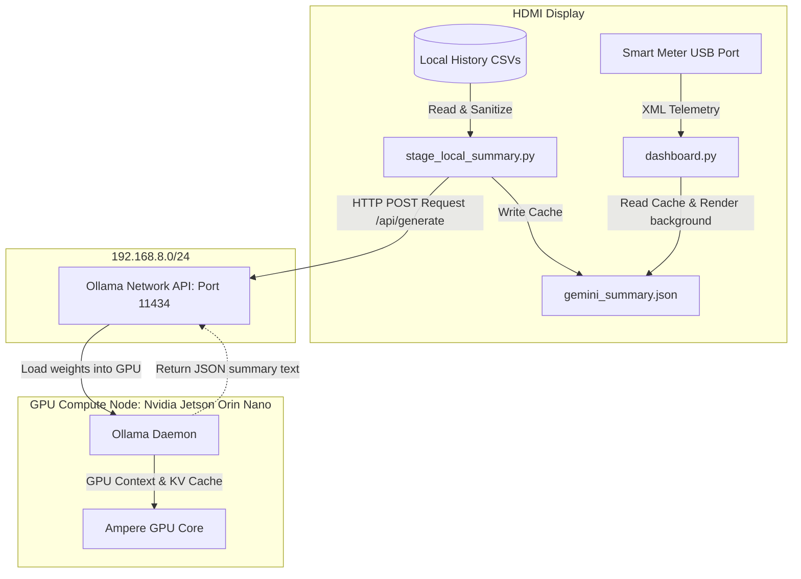

# Specification: Decentralized Local Edge AI Telemetry Dashboard

This specification defines the architecture for running a **decoupled, decentralized edge AI telemetry dashboard**. Under this setup:
1. A low-power **Raspberry Pi** acts as the dedicated kiosk display, reading serial telemetry from the Smart Meter and displaying real-time Matplotlib charts.
2. A high-performance **Nvidia Jetson Orin Nano** acts as a shared local AI inference server hosting the `gemma2:2b` model.

This configuration frees up the Jetson Orin Nano from being dedicated behind a single display monitor, allowing it to run a full desktop (GNOME) for other concurrent developer/GPU workloads.

---

## 1. Architectural System Diagram



---

## 2. Server Configuration: Nvidia Jetson Orin Nano

By default, Ollama binds its HTTP daemon to the local loopback interface (`127.0.0.1:11434`), restricting access to local applications. To expose it to other nodes on the LAN:

### Step A: Configure Ollama Service Variables
We override the service settings using systemd overrides:
1. Open the systemd editor for the Ollama service:
   ```bash
   sudo systemctl edit ollama.service
   ```
2. Insert the following configuration lines to bind Ollama to all network interfaces:
   ```ini
   [Service]
   Environment="OLLAMA_HOST=0.0.0.0"
   ```
3. Save and close the editor.

### Step B: Restart the Service
Reload systemd and restart the Ollama daemon:
   ```bash
   sudo systemctl daemon-reload
   sudo systemctl restart ollama
   ```

### Step C: Verify Network Exposure
Ensure the service is actively listening on all interfaces:
   ```bash
   sudo netstat -nap | grep 11434
   # Expected output shows: tcp  0  0  0.0.0.0:11434  0.0.0.0:*  LISTEN
   ```

---

## 3. Client Configuration: Raspberry Pi Kiosk

The Raspberry Pi will run the dashboard GUI and the local stager loop. Because the stager relies entirely on standard python libraries (`urllib.request`), no heavy dependencies or CUDA runtimes are needed on the Pi.

### Step A: Sync Codebase to Raspberry Pi
Clone/sync the telemetry dashboard repository to `/home/pi/rainforest-emu2-grid-dashboard` on the Pi.

### Step B: Configure environment variables
Create a `.env` configuration file in the project folder defining the remote Jetson Ollama endpoint:
```env
# Tell the dashboard GUI to read summaries from local cache
LLM_MODE="decoupled"

# Point the stager script to the Jetson Orin Nano's IP address on the LAN
OLLAMA_HOST="http://192.168.8.68:11434/api/generate"
EDGE_MODEL="gemma2:2b"
```

### Step C: Launch the Dashboard System
Run the launcher script on the Pi:
```bash
./run_dashboard_system.sh
```
The stager script (`stage_local_summary.py`) will run in the background, calculate stats locally from CSVs, send the small prompt payload over the LAN to the Jetson, and overwrite `gemini_summary.json` on the Pi for the GUI to display.

---

## 4. Security, Network & Fallbacks

> [!WARNING]
> Exposing Ollama to `0.0.0.0` allows any device on your local network to query your GPU server and load models.
> - Ensure your home router has UPnP disabled to prevent port forwarding 11434 to the public internet.
> - If desired, restrict access to the Raspberry Pi's IP address using the Jetson's local firewall (`ufw`):
>   ```bash
>   sudo ufw allow from <PI_IP_ADDRESS> to any port 11434 proto tcp
>   sudo ufw enable
>   ```

> [!NOTE]
> **Architectural Fallback**: If exposing the Ollama HTTP listener across the LAN is blocked or undesirable, the system can gracefully fall back to a file-sharing approach:
> 1. The Pi transfers the generated text prompt to the Jetson via `scp` or a mounted NFS share.
> 2. The Jetson monitors the directory, executes a local inference cycle via `localhost:11434`, and writes the summary to a shared `gemini_summary.json`.
> 3. The Pi simply reads the updated JSON via the same NFS mount or pulls it via `scp`.

---

## 5. Benefits and System Headroom Analysis

| Metric | Dedicated Jetson Kiosk | Decoupled Pi (Kiosk) + Jetson (AI Server) |
| :--- | :--- | :--- |
| **Jetson Memory Headroom** | GNOME (1.2 GB) + Gemma 2B (1.6 GB) + GUI (100 MB) = **4.3 GB total used** | Gemma 2B (1.6 GB) = **1.6 GB total used** (~5.8 GB free on Jetson) |
| **Jetson Portability** | Fixed behind the TV (DisplayPort/Serial tied) | Fully portable, server-hosted anywhere on local Wi-Fi/Ethernet |
| **Power Consumption** | Jetson Nano runs 24/7 (10-15W average) | Pi runs kiosk 24/7 (2-3W). Jetson handles idle/sleep modes dynamically. |
| **Reliability** | Smart meter serial cable must run directly to Jetson | Smart meter serial cable plugged directly into low-profile Pi |
