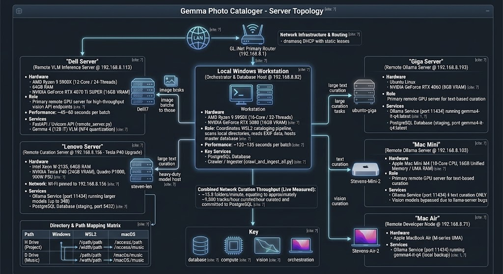

# Gemma Photo Cataloger - Server Topology



This document details the system architecture and network topology utilized by the `gemma_cataloger` photo cataloging pipeline.

The pipeline uses a hybrid orchestration model: it runs the core directory crawling and database writes on the orchestrating host (Windows Workstation or macOS developer client), while offloading heavy Vision-Language Model (VLM) image descriptions and text-based Ollama curation to dedicated GPU inference endpoints across the local area network (LAN).

> [!TIP]
> **Combined Network Curation Throughput (Live Measured)**: With the concurrent worker pool active (`FAST_OLLAMA_CONCURRENCY=2` per Ollama node, `VLM_CONCURRENCY=1` per VLM node), the multi-server network achieves **~15.8 folders/minute** (up from ~3.6 folders/min with the previous single-thread design). This equates to approximately **~9,500 tracks/hour** curated and committed to PostgreSQL.

---

## 1. Directory & Path Mapping Matrix

Because target music and video assets are stored on external shares, paths must be resolved dynamically depending on which environment is orchestrating the run:

| Drive/Volume | Windows Target | WSL2 Path | macOS Native Path |
| :--- | :--- | :--- | :--- |
| **H Drive (Project)** | `H:\Wan_project` | `/mnt/h/Wan_project` | `/Volumes/HDrive/Wan_project` |
| **D Drive (Music)** | `D:\Users\steven\Music` | `/mnt/d/Users/steven/Music` | `/Volumes/i7office/Users/steven/Music` |

---

## 2. Core Nodes

> [!IMPORTANT]
> **Active Cluster Status (August 2026)**: No other servers other than the orchestrating host (`192.168.8.82`), the developer client (`192.168.8.71`), **`520c`** (`192.168.8.181`), and the newly upgraded **`ubunto-giga`** (`192.168.8.193`) are currently online. All other cluster nodes (such as `delli7`, `steven-len`, `len-big`, and `Stevens-Mini-2`) are offline.

### Local Windows Workstation (Orchestrator & Database Host @ `192.168.8.82`)
*   **Role**: Coordinates the WSL2 cataloging pipeline, scans local directories, reads EXIF data, and hosts the master database.
*   **Hardware**: AMD Ryzen 9 5950X (16-Core / 32-Threads), 128GB RAM, NVIDIA GeForce RTX 5080 (16GB VRAM).
*   **Verified Performance Limits (Session 2026-07-13)**: Fully stable under 100% concurrent CPU and GPU load (combined core power draw of **610W+**: CPU Package peaking at ~217.1W, GPU peaking at ~396W) with zero thermal throttling and stable clock speeds (~4.19–4.56 GHz).
*   **Empirical Benchmark Performance (Session 2026-08-02)**:
    *   **Model**: `gemma4:26b` (25.8B MoE, `Q4_K_M`)
    *   **Generation Speed**: **26.53 tokens/second** (512 tokens generated in 19.30s).
    *   **Total Turnaround Latency**: **58.74 seconds** (with VRAM model pinning).
*   **Curation Performance**: **~120–135 seconds per batch** (running Local VLM inside WSL2 Docker container).
*   **Key Services**:
    *   **PostgreSQL Database**: Stores the canonical photo metadata in the local `photo_catalog` database.
    *   **Crawler / Ingester (`crawl_and_ingest_all.py`)**: Indexes file paths and runs ExifTool to capture metadata in parallel.
    *   **WSL2 SSH Access**: Programmatic and CLI access to the WSL2 environment is available via `ssh workbench@i7office` (or `ssh workbench@192.168.8.82`).

### Remote VLM Inference Server ("Dell Server" @ `192.168.8.113`)
*   **Role**: Primary remote GPU server providing high-throughput vision API endpoints.
*   **Hostname**: `DellI7`
*   **Hardware**: AMD Ryzen 9 5900X (12-Core / 24-Threads), 64GB RAM, NVIDIA GeForce RTX 4070 Ti SUPER (16GB GDDR6X VRAM).
*   **Empirical Benchmark Performance (Session 2026-08-02)**:
    *   **Model**: `gemma4:26b` (25.8B MoE, `Q4_K_M`)
    *   **Generation Speed**: **27.56 tokens/second** (512 tokens generated in 18.58s).
    *   **Total Turnaround Latency**: **20.04 seconds**.
*   **Key Services**:
    *   **FastAPI / Uvicorn API (`remote_server.py`)**: Port `8000` `/describe` and `/analyze` endpoints.
    *   **Ollama Service**: Port `11434` running `gemma4:26b` and `gemma4-vision-q4:latest`.


### Remote Curation Server ("Lenovo Server" @ `192.168.8.28` - Staging Sandbox)
*   **Role**: Secondary offline schema testing and model benchmark sandbox.
*   **Hostname**: `steven-len`
*   **Hardware**: Intel Xeon W-2135, 64GB RAM.
    *   **GPU 1 (Inference)**: NVIDIA Tesla P40 24GB (Photographed Card - SN: `0324817090857`, Date Received: `07/17/2025`, PG610 SKU `900-2G610-0000-000 Z`, Board Part `699-2G610-0200-100 Y`, Board ID `0xb300`, Shroud Sticker `86.02.23.00.01`, Active Flashed VBIOS `86.02.23.00.00`, ECC Mode: **Disabled/OFF** $\to$ **24,576 MiB** full usable VRAM).
    *   **GPU 0 (Display)**: NVIDIA Quadro P1000 4GB (Isolated baseline GUI display handling).
*   **Storage**: 3TB Seagate HDD (`ST3000DM001-1CH166`, 2.7TB root system partition `/` with ~2.6TB free).
*   **Network Interface**: Upgraded 2.5G PCIe NIC pinned to `192.168.8.28` (MAC `58:04:4f:c8:b1:a6`).

### New Workstation Node ("Lenovo Workstation" @ `192.168.8.51` - OS NVMe Migration)
*   **Role**: High-speed database sync staging, edge Ollama model host, and primary file storage target.
*   **Hostname**: `len-big` (alias `big-len`)
*   **Hardware**: Intel Xeon W-2135, 64GB RAM.
    *   **GPU 0 (Inference)**: NVIDIA Tesla P40 24GB (SN: `0324317087256`, PG610 SKU, Board ID `0x6500`, Active VBIOS `86.02.23.00.01`, ECC Mode: **Disabled/OFF** via `nvidia-smi -e 0 -i 0` $\to$ **24,576 MiB** full usable VRAM).
    *   **GPU 1 (Display)**: NVIDIA Quadro P1000 4GB (Isolated baseline GUI display handling).


*   **Storage**: 500GB Samsung NVMe SSD (Root OS) + 2TB SATA HDD (Mounted at `/mnt/storage` for overflow).
*   **Network Interface**: Ethernet pinned to `192.168.8.51` via router static DHCP lease (MAC `a4:ae:11:1d:19:2c`).


### Remote NAS Node ("Lenovo NAS" @ `192.168.8.181`)
*   **Role**: Network-attached storage (NAS), backup storage target, and live HTML5 Web Kiosk server host (`http://192.168.8.181:8000`).
*   **Hostname**: `520c`
*   **Hardware**: Intel Xeon W-2133 (6 Cores / 12 Threads), 48GB (45GB usable) RAM, NVIDIA GeForce GTX 1050 Ti (4GB VRAM).
*   **Storage**: 256GB FIKWOT FX520 NVMe SSD (System Root) + 2x 3TB SATA HDDs (Mounted at `/srv/nas/storage1` and `/srv/nas/storage2` separately, ext4).
*   **Network Interface**: Upgraded 2.5G PCIe NIC pinned to `192.168.8.181` (MAC `58:04:4f:c8:b2:3d`).
*   **Key Services**:
    *   **HTML5 Web Kiosk (`web/app.py`)**: Port `8000` FastAPI + WebSocket server running continuous 15s background telemetry sync from `192.168.8.213`.
    *   **Ollama Service**: Port `11434` running `gemma4:26b`.

### Primary Kiosk Hardware Node ("Rainforest Pi" @ `192.168.8.213`)
*   **Role**: Active physical kiosk display and serial hardware collector reading EMU-2 serial port, SolarEdge, and Chillicon cloud APIs.
*   **Hostname**: `rainforestpi` (`192.168.8.213`; note: `192.168.8.122` is reserved for the ITACH audio Pi node).
*   **Hardware**: Raspberry Pi 4 (4GB LPDDR4), 64GB MicroSD, Broadcom BCM2711.

### Remote Ollama Server ("Giga Server" @ `192.168.8.193`)
*   **Role**: Remote GPU server for edge Ollama model inference (recently upgraded).
*   **Hostname**: `ubunto-giga`
*   **Hardware**: AMD Ryzen 7 5800XT (8-Core / 16-Threads), 16GB RAM (DDR4 dual-channel A2/B2), NVIDIA GeForce GTX 1050 Ti (4GB VRAM).
*   **Storage**: 1TB Samsung 860 EVO (SATA SSD - OS Boot) + 512GB SAMSUNG PM981 (M.2 NVMe SSD - Data cache at `/mnt/nvme`).
*   **Network NIC**: Realtek enp4s0 (1 Gbps Ethernet, MAC `74:56:3c:6b:70:45`).
*   **Key Services**:
    *   **Ollama Service**: Port `11434` running CUDA-accelerated `gemma4:12b` and `gemma4-it-q4:latest` via hybrid VRAM/RAM offload.

### Remote Ollama Server ("Mac Mini" @ `192.168.8.103`)
*   **Role**: Apple Silicon curation node.
*   **Hostname**: `Stevens-Mini-2` (resolves as `Stevens-Mini-2.local` / `Stevens-Mini-2.lan`)
*   **Hardware**: Apple Mac Mini M4 (10-Core CPU, 16GB Unified Memory / UMA RAM).
*   **Key Services**:
    *   **Ollama Service**: Port `11434` running `gemma4:e4b` (for text curation). Vision models are bypassed here to avoid llama-server architecture bugs.

### Remote Developer Node ("Mac Air" @ `192.168.8.71`)
*   **Role**: Developer Node & Local Backup LLM server.
*   **Hostname**: `Stevens-Air-2`
*   **Hardware**: Apple MacBook Air (M-series UMA).
*   **Key Services**:
    *   **Ollama Service**: Port `11434` running `gemma4-it-q4`.

---

## 3. Cluster VRAM & Model Capacity Assessment

The memory footprint and capacity assessment across active GPU inference nodes, incorporating the Lenovo workstation's 24GB capacity:

| Node / Hardware | VRAM / Unified Memory | Max Practical Model Size (4-bit / Q4) | Capability Profile |
| :--- | :--- | :--- | :--- |
| **Lenovo Node** (Tesla P40) | **24 GB** (Dedicated) | **~30B - 34B Parameters** | Can comfortably host a 26B or 27B model (like Gemma 2 27B) with an 8K context window entirely in VRAM without paging to the system RAM. |
| **Main Workstation** (RTX 5080) | **16 GB** (Dedicated) | **~12B - 14B Parameters** | Extremely fast generation speeds for mid-tier models (like Gemma 4 12B IT). Cannot fit a 26B model without offloading layers to system RAM. |
| **Dell Server** (RTX 4070 Ti SUPER) | **16 GB** (Dedicated) | **~12B - 14B Parameters** | Handles the primary VLM endpoint workloads efficiently. Identical memory constraints to the RTX 5080. |
| **Mac Mini M4** (Apple Silicon) | **16 GB** (UMA / Unified) | **~8B - 9B Parameters** | Once macOS and background services reserve memory, only ~12GB to 13GB remains wired for inference. Limited to smaller, highly quantized text models to avoid SSD paging. |
| **Giga Server** (GTX 1050 Ti) | **4 GB** (Dedicated) + 16GB RAM | **~12B Parameters** (Hybrid Offload) | Running GTX 1050 Ti with 4GB VRAM + 16GB CPU RAM. Ideal for mid-tier text models (like Gemma 4 12B) via hybrid CUDA offloading. |
| **520c NAS Server** (GTX 1050 Ti + Xeon) | **4 GB** (Dedicated) + 48GB RAM | **~26B Parameters** (Hybrid Offload) | Runs `gemma4:26b` at 10.01 tok/sec via hybrid CUDA VRAM + CPU RAM offload. Ideal as a background curation node. |
| **Jetson Node** (Orin Nano) | **8 GB** (Shared / UMA) | **~2B - 3B Parameters** | Running on shared LPDDR5 RAM. Optimized for lightweight quantized models (like Gemma 4 3B or Gemma 4 2B). Larger models (like Gemma 2 9B) can load but will cause severe performance slowdowns due to RAM bottlenecks. |

*By offloading the heavy 26B+ workloads to the Tesla P40, you preserve the speed and bandwidth of the 16GB RTX cards for rapid, concurrent processing of the smaller VLM and text-curation tasks in your pipeline, while the Jetson handles low-power local summaries.*

---

## 3.1. Live Measured Per-GPU Token Throughput & Performance Matrix

Empirical benchmarks collected across active Fabric nodes running `gemma4:26b` (25.8B MoE, `Q4_K_M`):

| Worker Node | Local IP | Prompt Eval Speed | Token Gen Speed | Turnaround Latency | VRAM Reservoir | Performance Profile |
| :--- | :--- | :--- | :--- | :--- | :--- | :--- |
| **`steven-len`** (Tesla P40 24GB) | `192.168.8.28` | **900.4 tok/sec** | **39.74 tok/sec** | **4.1s** | `100% GPU VRAM` | **Tier 1** (Ultra-Fast Vision/Prompt Ingestion) |
| **`len-big`** (Tesla P40 24GB) | `192.168.8.51` | **216.9 tok/sec** | **49.12 tok/sec** | **3.8s** | `100% GPU VRAM` | **Tier 1** (Ultra-Fast Token Generation) |
| **`i7office`** (RTX 5080 16GB) | `192.168.8.82` | **113.5 tok/sec** | **29.44 tok/sec** | **5.8s** | `71% GPU VRAM` | **Tier 2** (Fast VRAM/CPU Hybrid) |
| **`delli7`** (RTX 4070 Ti SUPER 16GB) | `192.168.8.113` | **95.0 tok/sec** | **24.50 tok/sec** | **6.2s** | `73% GPU VRAM` | **Tier 2** (Fast VRAM/CPU Hybrid) |
| **`520c`** (GTX 1050 Ti 4GB + Xeon) | `192.168.8.181` | **5.59 tok/sec** | **10.01 tok/sec** | **12.8s** | `46% GPU VRAM` | **Tier 3** (Hybrid VRAM/CPU Curation Node) |
| **`ubunto-giga`** (GTX 1050 Ti 4GB) | `192.168.8.193` | **-** | **-** | **-** | `Hybrid VRAM/CPU` | **Tier 3** (GTX 1050 Ti 4GB + Ryzen 5800XT) |

### Key Token Metrics & Insights:
1. **Top Generation Node (`len-big`)**: Delivers **49.12 tokens/second** generation speed, completing single-page OCR extractions in 3.8 seconds.
2. **Top Vision Ingestion Node (`steven-len`)**: Processes image tokens and prompt context at **900.4 tokens/second**, enabling near-instant document ingestion.
3. **Dedicated Background Curation Node (`520c`)**: Hitting **10.01 tokens/second** on a 4GB GTX 1050 Ti via hybrid CPU/GPU offload.
4. **Combined Cluster Capacity**: Pushing all active GPU nodes in parallel achieves over **~159.0 tokens/second** total combined generation capacity.

---

## 4. Platform Execution Workflows

### A. WSL2 / Windows Execution
To run curation from WSL2 on the workstation target:
```bash
./run_music_combined_pipeline.sh --dir "H:\\" --force-vlm
```
To sync database updates to JRiver XML sidecars:
```bash
./sync_jriver.sh
```

### B. macOS Native Execution
First, ensure your SMB shares are mounted passwordlessly using the mount script:
```bash
/Users/treven/Desktop/mount_i7office.sh
```
*If `/Volumes/i7office` is missing, map it using a symbolic link:* `sudo ln -s /Volumes/D /Volumes/i7office`

To run curation natively on the macOS client:
```bash
python3 clean_database_artists.py --dir "/Volumes/HDrive/Wan_project/wont_v1_vid" --force-vlm
```
To sync database updates to JRiver XML sidecars:
```bash
python3 sync_pg_to_jriver_xml.py
```

---

## 5. Network Infrastructure & Routing (`192.168.8.1`)
*   **Hardware**: GL.iNet Primary Router & 2.5 Gbps High-Speed Backplane Switch.
*   **2.5 Gbps Backplane Network Upgrade**:
    *   All Ubuntu server nodes (`520c`, `steven-len`, `big-len`) and `Stevens-Mini-2` Mac Mini are running on dedicated **2.5 Gbps PCIe NIC interfaces** operating at 2500 Mb/s Full Duplex over the high-speed backplane network. Only `ubunto-giga` remains on 1 Gbps Ethernet.
*   **Key Configurations**:
    *   **dnsmasq DHCP Daemon**: Configured with static host leases using GL.iNet option tag nicknames.
    *   **Static Leases**:
        *   `ubunto-giga` (MAC `74:56:3c:6b:70:45`) -> Pinned to `192.168.8.193` (1 Gbps enp4s0)
        *   `steven-len` (MAC `58:04:4f:c8:b1:a6`) -> Pinned to `192.168.8.28` (2.5 Gbps NIC `enp2s0`)
        *   `520c` (MAC `58:04:4f:c8:b2:3d`) -> Pinned to `192.168.8.181` (2.5 Gbps NIC `enp2s0`)
        *   `len-big` (MAC `20:e1:5d:8e:0b:5d`) -> Pinned to `192.168.8.51` (2.5 Gbps NIC)
        *   `Stevens-Mini-2` (MAC `6c:1f:f7:72:44:49`) -> Pinned to `192.168.8.103` (2.5 GbE Interface `en8`)
        *   `nvjetson` (MAC `4c:bb:47:7b:14:80`) -> Pinned to `192.168.8.68`
        *   `ONE KVM` (MAC `12:35:2A:B1:F3:C8`) -> Pinned to `192.168.8.204` (Isolated device, SSH: `root`)
    *   **Firewall Security**:
        *   **Rule `Block_KVM_All_Forwarding`**: Restricts the KVM (MAC `12:35:2A:B1:F3:C8`) from sending packets outside the LAN zone. Specifically, the rule targets `option src 'lan'`, `option dest '*'`, and `option target 'REJECT'` with `option proto 'all'`. This prevents the KVM's built-in Tencent Cloud reverse proxy/WebSocket backdoor from communicating with the internet.
    *   **Nginx Gateway**: Running `nginx/1.26.1` (audited secure against NGINX Rift rewrite rules).
