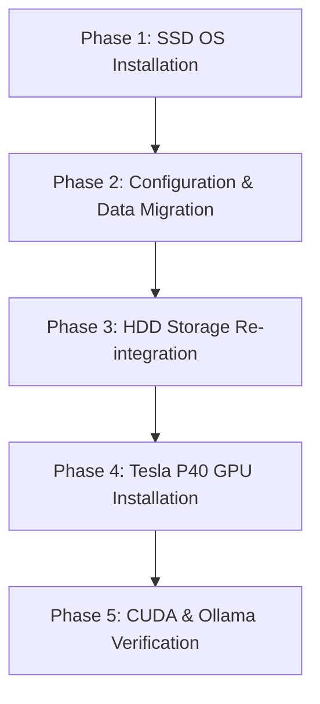

# Migration Plan: steven-len SSD Boot & Tesla P40 GPU Installation

This document outlines the step-by-step procedure for upgrading the storage and compute capabilities of the `steven-len` server (`192.168.8.156`). It establishes a rigorous safety protocol for modifying `/etc/fstab` to avoid the boot loops and configuration mistakes encountered during the `520c` migration.

---

## 1. Safety Protocols for `/etc/fstab` Modifications
To prevent the system from failing to boot and dropping into an emergency shell, we will enforce the following procedures during storage configuration:

1. **Always Use UUIDs**: Never use device nodes like `/dev/sdb1` or `/dev/nvme0n1p1` in `/etc/fstab`. Device assignments are dynamic and can shift when the GPU or other hardware is installed. Always query and use the exact UUID.
2. **Double-Check with `blkid`**: Always run `sudo blkid` to copy/paste the exact UUID and filesystem type (`TYPE="ext4"`).
3. **Perform Pre-Reboot Validation**: After editing `/etc/fstab`, and **before** rebooting, always run:
   ```bash
   # Test all mounts specified in fstab
   sudo mount -a
   
   # Reload systemd manager configuration to verify no syntax errors
   sudo systemctl daemon-reload
   ```
   *If `sudo mount -a` returns any warning or error, do not reboot. Fix the error immediately.*
4. **Maintain a Local Backup**: Always create a dated backup before editing:
   ```bash
   sudo cp /etc/fstab /etc/fstab.bak.$(date +%F)
   ```
5. **Rebuild Initramfs**: If changing boot volumes or swap configurations, rebuild the initial RAM-disk so the kernel boots with the updated disk mappings:
   ```bash
   sudo update-initramfs -u -k all
   ```

---

## 2. Order of Operations



### Phase 1: SSD Physical Install & Fresh Ubuntu OS
1. Shut down `steven-len` and unplug the power cable.
2. Install the 1TB SSD. Keep the 3TB HDD connected (we will overwrite its boot flag later).
3. Insert your Ubuntu Live USB installer.
4. Boot into the BIOS/UEFI menu and ensure UEFI boot mode is enabled.
5. Boot to the Live USB and select **Install Ubuntu**.
6. **Partitioning**: Select the **1TB SSD** as the installation target. Let the installer automatically erase the disk, write a new GPT partition table, and create the standard EFI and root (`/`) ext4 partitions.
7. Complete the OS installation, reboot, and verify the SSD boots cleanly to the desktop/CLI.

### Phase 2: Configuration & Data Migration
Once booted into the new SSD OS, we will mount the 3TB HDD to carry over your existing configurations:

1. Identify the 3TB HDD root partition using `sudo blkid` (look for the label or partition size ~2.7TB).
2. Create a temporary mount point and mount the HDD:
   ```bash
   sudo mkdir -p /mnt/old-hdd
   sudo mount -o ro /dev/sdXy /mnt/old-hdd  # Mount as read-only for safety
   ```
3. **Migrate SSH Settings**:
   ```bash
   mkdir -p ~/.ssh
   chmod 700 ~/.ssh
   cp /mnt/old-hdd/home/*/.ssh/authorized_keys ~/.ssh/
   chmod 600 ~/.ssh/authorized_keys
   ```
4. **Migrate Ollama Cache**:
   ```bash
   # Create the default directory
   mkdir -p ~/.ollama
   # Copy over model blobs to avoid redownloading
   cp -r /mnt/old-hdd/home/*/.ollama/models ~/.ollama/
   ```
5. **Restore Custom Scripts / Cron Jobs**:
   * Inspect `/mnt/old-hdd/etc/systemd/system/` for any custom services (like stagers or API endpoints).
   * Check user crontabs: `sudo crontab -u username -l` on the old partition.
6. Verify SSH access works natively from `i7office` or your Mac without requiring key regeneration.

### Phase 3: HDD Storage Re-integration
After validating that all configurations are safely running from the SSD:

1. Clean the old partitions on the 3TB HDD using `fdisk` or `gparted` to remove old boot/system partitions.
2. Create a single new ext4 partition on the 3TB HDD.
3. Query its UUID:
   ```bash
   sudo blkid /dev/sdX1
   ```
4. Create the mount directory:
   ```bash
   sudo mkdir -p /mnt/storage
   sudo chown -R $USER:$USER /mnt/storage
   ```
5. **Modify `/etc/fstab` (Applying Safety Protocols)**:
   Add the following line to `/etc/fstab` (replace with the exact UUID):
   ```text
   UUID=xxxx-xxxx-xxxx-xxxx  /mnt/storage  ext4  defaults,noatime  0  2
   ```
6. **Validate**:
   Run `sudo mount -a` and `sudo systemctl daemon-reload`. Ensure the HDD mounts correctly at `/mnt/storage` without errors.

### Phase 4: Tesla P40 GPU Installation
1. Shut down the server and unplug the power.
2. **GPU Slot Selection**:
   * Install the **NVIDIA Tesla P40** into PCIe **Slot 4** (the lower PCIe 3.0 x16 CPU-connected slot).
   * Install/keep the **NVIDIA Quadro P1000** in PCIe **Slot 2** (the upper PCIe 3.0 x16 CPU-connected slot).
   * *Rationale*: This leaves **Slot 3** empty as a physical buffer, giving the P40's custom 3D-printed cooling shroud and blower fan proper clearance and preventing thermal starvation for both GPUs. It also ensures both cards get full x16 CPU lanes (unlike Slot 1 which is x8, or Slot 3 which is x4 PCH-routed).
3. **Power Delivery**: Connect the dual PCIe 8-pin to EPS-12V 8-pin adapter to the P40. Verify the cables are seated securely.
4. **Cooling Setup**: Mount your custom 3D-printed cooling shroud and blower fan. Connect the blower fan to a high-output chassis fan header or direct power.
5. Power on the system.

### Phase 5: CUDA & Ollama Verification
1. Install the proprietary NVIDIA drivers and CUDA toolkit:
   ```bash
   sudo apt update
   sudo apt install nvidia-driver-535 nvidia-utils-535 -y
   ```
2. Reboot and verify the GPU is recognized:
   ```bash
   nvidia-smi
   ```
   *Verify that the GPU temperature is stable at idle and the fan is operating.*
3. Install Ollama:
   ```bash
   curl -fsSL https://ollama.com/install.sh | sh
   ```
4. Test running **Gemma 4 12B**:
   ```bash
   ollama run gemma4:12b
   ```
   *Run `nvidia-smi` in another terminal window to confirm the model weights are loaded entirely into VRAM and computation is occurring on the GPU.*
5. Once validated, load your target **26B MoE model** and run a generation check.
